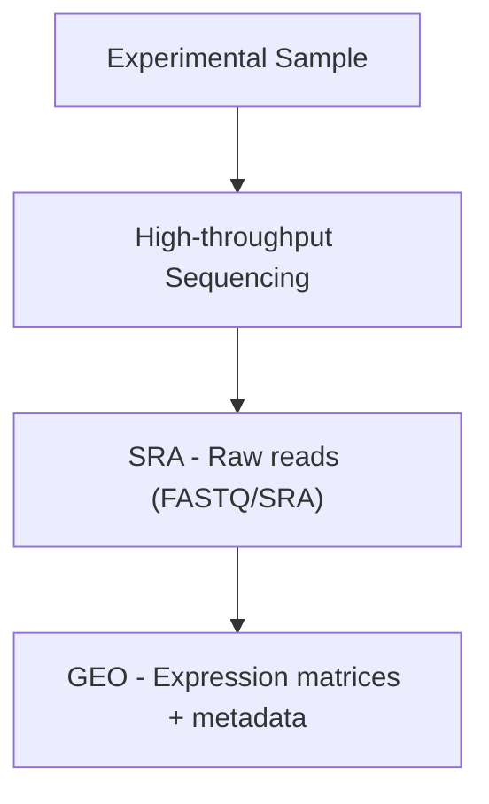

# 🗃️ This document records the structure of several databases
🚨 If you don't believe in me, copy and paste this page into the chat box of an AI you trust to see whether they are correct. I ⚠️**highly recommend**⚠️ you to do this, because I maintain this repo myself, so it is easy for me to make some mistakes.

# 1. NCBI

## 1.1 Naming
NCBI stands for National Center of Biotechnology Information.

## 1.2 GenBank
GenBank is a public nucleotide sequence database. The sequencec are submitted by researchers worldwide. It contains:
- Raw nucleotide sequences with annotation (gene structure, protein products, publications)
- Organism taxonomy (linked to NCBI Taxonomy)
- Literature references (linked to PubMed)

How can we use it:
- Retrieve known gene nucleotide sequences
- Perform sequence similarity searches (BLAST)
- Cross-species homology analysis
- Primer design, molecular cloning, phylogenetic analysis

## 1.3 RefSeq
RefSeq stands for Reference Sequence Database. RefSeq provides a curated, non-redundant, and authoritative collection of reference sequences, including genomic DNA, transcripts, and proteins. The features of data in RefSeq:
- Derived from GenBank, but manually curated, filtered, and quality-controlled
- Provides a single, standard “reference” for each gene
- Organized by species (human, mouse, bacteria, virus, etc.)

How can we use it:
- Serve as a standard reference for sequence alignment and gene annotation
- Reference for transcriptomic quantification (RNA-seq pseudo-alignment)
- Variant annotation

About the prefix:
| Prefix | Dataset / Category | Molecule Type | Description | Example |
|--------|--------------------|---------------|-------------|---------|
| NC_    | Genome assembly | Complete chromosome or genomic molecule | Represents a curated "reference" complete genomic molecule. | `NC_000023.11` |
| AC_    | Alternate assembly | Complete genomic molecule | Alternate or supplemental genomic molecule accession (alternate assembly). | `AC_000158.1` |
| NT_    | Contig / scaffold | Fragmented contig or scaffold | Represents contigs or scaffolds (from clone-based or WGS assemblies). | `NT_113897.1` |
| NW_    | WGS scaffold | Scaffold (mainly from WGS) | Similar to NT_, but mostly for WGS-based scaffolds. | `NW_003315950.2` |
| NG_    | Gene / genomic region | Gene or gene region | Gene or genomic region records (includes curated gene model with intron/exon annotation). | `NG_012232.1` |
| NM_    | mRNA transcript | Coding transcript (mRNA) | Curated mRNA transcript. | `NM_004006.2` |
| NR_    | non-coding RNA transcript | Non-coding RNA (ncRNA) | Curated non-coding RNA. | `NR_004430.2` |
| NP_    | protein product | Protein product | Protein sequence corresponding to NM_ transcripts. | `NP_003997.1` |
| XM_    | Model RefSeq | Predicted mRNA transcript | Automatically predicted transcript. | `XM_005252345.1` |
| XR_    | Model RefSeq | Predicted non-coding RNA | Automatically predicted ncRNA record. | `XR_001234567.1` |
| XP_    | Model RefSeq | Predicted protein (eukaryotic) | Protein sequence predicted from predicted transcript models (eukaryotic). | `XP_011518123.1` |
| YP_    | Prokaryotic historical / known | Bacterial / archaeal protein (historical) | Early prokaryotic protein accessions, partly replaced by WP_. | `YP_009724390.1` |
| WP_    | Non-redundant protein (prokaryotic) | Non-redundant protein (prokaryotic) | Non-redundant protein accessions for RefSeq. | `WP_012345678.1` |
| NZ_    | GenBank / RefSeq (from WGS) | Draft genome or WGS data | Represents WGS project or unfinished genome scaffolds. | `NZ_CP012345.1` |
| AP_    | protein product | protein | Protein product annotated on AC_ alternate assembly. | — |
| ZP_    | Deprecated / historical | Early WGS protein accessions (deprecated) | Previously used for WGS protein numbering, replaced by WP_. | (deprecated) |

## 1.3 GEO
GEO stands for Gene Expression Omnibus. GEO is a public functional genomics data repository that stores high-throughput expression and functional data, including:
- Microarray
- RNA-seq
- ChIP-seq
- ATAC-seq, etc.

GEO organizes data into several hierarchical entities:
- **GSE (Series)**: a full study or experiment
- **GSM (Sample)**: an individual biological sample
- **GPL (Platform)**: the technology used (microarray chip, sequencing platform)
- **GDS (Dataset)**: curated datasets

How can we use it:
- Explore public transcriptomic data
- Perform differential expression analysis
- Cluster and visualize gene expression patterns
- Validate experimental reproducibility

## 1.4 SRA
SRA stands for Sequence Read Archive. SRA is an archive of raw sequencing reads from various high-throughput sequencing technologies (Illumina, PacBio, Nanopore, etc.).

Data Structure:
- **SRP / PRJNA**: BioProject (project-level)
- **SRX**: Experiment
- **SRS**: Sample
- **SRR**: Run (individual sequencing run)

How can we use it:
- Re-analyze publicly available RNA-seq / WGS / WES data
- Develop or benchmark bioinformatics pipelines
- Validate algorithms and methods

💞 **Relationship with GEO**:

1️⃣ Basic Concepts

| Database | Type | Data Content |
|----------|------|--------------|
| GEO | Functional genomics database | High-throughput gene expression data, phenotypic information, experiment design; includes processed data such as normalized expression counts from RNA-seq experiments |
| SRA | Raw sequencing data repository | Raw high-throughput sequencing reads (FASTQ/SRA), including RNA-seq, WGS, ChIP-seq, ATAC-seq, etc. |

---

2️⃣ Data Type

| Feature | GEO | SRA |
|---------|-----|-----|
| Data level | Processed or normalized expression matrices + metadata | Raw sequencing reads (unprocessed) |
| File format | TXT, SeriesMatrix, SOFT, GEOquery-compatible | FASTQ, SRA format |

---

3️⃣ Data Association

- Typical submission workflow:
	1. Researchers perform high-throughput sequencing experiments (e.g., RNA-seq)
	2. Raw reads are submitted to SRA 
	3. Processed expression matrices and metadata are submitted to GEO

- GEO samples often correspond to SRA raw reads.  

---

4️⃣ Data Flow Diagram

- In simple terms:
  - **SRA = Raw material**  
  - **GEO = Processed product**  
