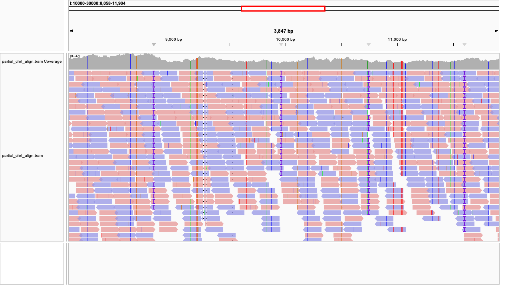

# 🗂️ This document records the fundamental file formats in bioinformatics
🚨 If you don't believe in me, copy and paste this page into the chat box of an AI you trust to see whether they are correct. I ⚠️**highly recommend**⚠️ you to do this, because I maintain this repo myself, so it is easy for me to make some mistakes.

## 1. FASTA

### 1.1 Nomenclature (naming)
At the beginning, FASTA was the name of a program created by David J. Lipman and William R. Pearson to perform rapid sequence comparison. This program required a specific input file structure, which later became known as the FASTA format.

### 1.2 Overview
The essence of FASTA is **plain text** — you can open it with any text editor. File names are usually something like `seq.fa` or `seq.fasta`.

Here is an example:
```bash
>seq1 Random DNA sequence example
ATGCGTAGCTAGCTACGATCGATCGTAGCTAGCTAGCATCGATCGTACGATCGATCGTAGCTAG
>seq2 Random DNA sequence example
AAGCATCAGCTAGAGCTAGCATCGATCGTACGACGATCGATAGCTAGGATCGATCGTAGGCTTA
```
```bash
>seq3 Random protein sequence example
MKTAYIAKQRQISFVKSHFSRQLEERLGLIEVQANLQDKPEWVILKQME
```
You can see that each sequence starts with a greater-than symbol (>) and some descriptions. There is no strict restriction on how many characters at most can appear on a single line.

## 2. FASTQ

### 2.1 Nomenclature (naming)
FASTQ is FASTA + Quality. Very easy.

### 2.2 Overview
So, what is "Quality"? It is a score (Phred-score) that reflects the sequencing machine's confidence on this nucleotide. It is allocated by the sequencing machine automatically. The common range for this socre in FASTQ file is $0-40$, which is calculated as $Q = -10\log_{10} P$, where P is the probability that this base is incorrect. BTW, FASTQ is also **plain text** (file names are always `read.fastq`). 

Let's look at an example first:
```bash
@readID1
GGGAAAAGTCAATGAAGCCAGGCAAAATGATCAAGTAAAAGCACCTCAATAAAATGCATTTC
+
CCCFFFFFHHHHHJJJJIHIJJIJJJJJJJJJJJJIJJIIJJJJJJJJIIJFEFCDDEEDEE
@readID2
AAAATATTTTTTCTTTTAACACAGACATAAGCTACAACAAGTAGAAAGATTAAGACCTCCCC
+
@@DDFFFIII;:::9?9)?G8;9/8'87@D=?;?A>D?C@?C=?BBB<:BBBB<?:>::?BB
```
Each sequence (called read) occupies four lines in a FASTQ file. The first line starts with `@` and followed by some description. The second line is the sequence obtained by the machine. The third line is a single +. The fourth line is the quality socre of each base. You can see that line two and four have identical lengths. But you may wonder where is the score? I only see several nonsence characters. The thing is that we use ASCII value of the character to represent the score. For exmaple the ASCII value of "?" is $63$, then the quality score at this position is $63 - 33 = 30$. Sometimes we need to subtract $64$ from the ASCII value in retro FASTQ encoding system. You don't need to worry about why is it. It's just weird conventions.

## 3. SAM & BAM

### 3.1 Nomenclature (naming)
SAM stands for Sequence Alignment/Map. BAM is simply the **binary** version of SAM — same information, smaller file size, faster to read and write.

### 3.2 Alignment
A quick refresher here. After sequencing, we get numerous reads. Reads are actually small fragments randomly sampled from the whole DNA or RNA molecules. To make sense of them, we need to find out where each read comes from in the genome. This process is called alignment.

An aligner (e.g., BWA, Bowtie2, STAR) takes two inputs:
- A reference genome (usually in FASTA format)
- A set of reads (in FASTQ format)

and produces a SAM/BAM file, where each read is assigned to a position on the genome, along with some extra information.

You can think of it as:  
> “FASTQ tells you what we sequenced, SAM tells you where it belongs.”

### 3.3 Overview
First things first, SAM is also **plain text**. SAM is very complicated. You don't have to know everything about it. In practice, we often turn to genome browsers like IGV to visualize the alignment results, instead of reading the texts directly. However, it is helpful to gain some rough notions (files are like `align.sam` or`align.bam`).

Example goes first (truncated):
```bash
@HD	VN:1.5	SO:unsorted	GO:query
@SQ	SN:I:10000-30000	LN:20001
@PG	ID:bwa	PN:bwa	VN:0.7.19-r1273	CL:bwa mem refs/partial_chrI.fa data/yeast_chrI_sreads_1.fq data/yeast_chrI_sreads_2.fq
I:10000-30000-3984	99	I:10000-30000	16762	60	121M1D29M	=	16935	323	CTGATGACAATGATGGTCTCATCAGTTGGCAAACCATTGGTACCGGTGACTGTGGTCAATTCGGTAGAAGTAGAGGTAAAAGTGCTGTTCCATGGCTCATTTGTAGTTATGGCAGTAGTGGTGTTGTTGGTGTTCTGATTACAATGATGG	CC1CGG8GGGGGGGGJJJ1GGJJJJJJJJCJJJJJJGJJGJGJJG=JJJGCGJJJGJJGCGJGGCGCJGGGGCGGGGCCGGGG=GGGGCGGC8GGGG=CCJGC=GGGCCGGGGGCGGGGGGC8=GGGCGCGGGGGCCGGCGGGGGGGGCG	NM:i:2	MD:Z:99G21^C29	MC:Z:150M	MQ:i:60	AS:i:138	XS:i:113	XA:Z:I:10000-30000,+16627,121M1D29M,7;I:10000-30000,+16492,121M1D29M,7;
I:10000-30000-3984	147	I:10000-30000	16935	60	150M	=	16762	-323	GATGCCAGTGACTGTGGTCAATTCGGTAGAAGTAGAGGTAAAAGTGCTGTTCCATGGCTCAGTTGTAGTTATGATGGTGCTAGCAGATGTTGGAGTACTGATGACAATGACGGTTTCGTCAGTTGGAACGCCGTTGGTACCGGTGTCGGT	CGGGG=CGG=8GCGGCCGGG==GCGGCGGGG=GGCC1CGCGGGJJJJCGCG=GCGGGCCCGGGCGCCCCGG1CCG18GJG8JGGGG(GGJGG=GJCJJJGJJJJJGGCGCG1JJJCJJGGGJGGJJGGGJJGJJGGGGGGGGCGGGGCCC	NM:i:4	MD:Z:1G84T9T48A4	MC:Z:121M1D29M	MQ:i:60	AS:i:133	XS:i:66
I:10000-30000-3982	83	I:10000-30000	13816	60	145M1I4M	=	13637	-328	ATAACAATAACGTTTTCTTTATGATACATATATCTACTTTTTCAAAAAAGGAAGCGCAATAATTATCATTTATTTCAATTTGAATATTTGAAAGTTTGGAGGAGAAACAGTTAAAAAATAATTCATGTCAGCGTATATTTAGCAATAGAA	CGCGCC8GG1C1GG=GCCGG=CG8GCGGGCG(G1CG=GGGGGGGGC=CGJ=G=1GGGGGGGCGGCGGCGCGCG8GGGJGCGGG1=GJJ=GCGJCJGJJGJCGGJJG=JJJJJCJJJGGJJCJJJCJGJJCJGJJJJJGGGGGCGGGGCCC	NM:i:3	MD:Z:59G12G76	MC:Z:150M	MQ:i:60	AS:i:135	XS:i:0
I:10000-30000-3982	163	I:10000-30000	13637	60	150M	=	13816	328	TTCTGTTTCTATAAGTGTTAGTTGTAACTTATGAAATATCGATATAAATTCGAAGTGTTGTTTGCAGGATATAAATCAAAAAAAAAAAAAAAAAAAAAAAATTTAATAAATAAATAAAATAAATACAATGATATTGATAACGGTGAAATT	CCCGCGG=GGGGGGJJJGJJJJJGGJGGJJJG=GGJGGGJJJJGJJJJGJJGJ=CGGGG=JJGGCJCGJGGGGGJGGGGGGC=CC11=CGGCG1CGGCG1CC=JJJJCG8GG=G=G=CGGGGCGGCCCGGCGC8GGGGG8CGGGCCGCCC	NM:i:3	MD:Z:43T59A30C15	MC:Z:145M1I4M	MQ:i:60	AS:i:135	XS:i:0
```
In this example, we align the reads against the chromosome I:10000-30000 stretch of yeast (S.cerevisiae). The first few lines starting with `@` belong to header section. They describe some metadata of this file. After that, there are numerous lines. Each line is the alignment result of one read. Now let's break this chaos down.
- `@HD` means header.
	- `VN` (version) is the SAM format version.
	- `SO` (sorting order) tells whether the reads are sorted by coordinates or not. We assign a coordiate to each base in the genome, so the coordinate for a read describes the location of it on the genome.
	- `GO` (group order) is very rarely seen. It says reads are grouped by query name (read's IDs in this case)
- `SQ` means sequence.
	- `SN` (sequence name) tells you the reference sequence name (`I:10000-30000` in this case).
	- `LN` (length) is the length of the reference sequence.
- `PG` is the program line.
	- `ID` is the ID of the aligner/program used (`bwa` in this case).
	- `PN` (program name) is the program name.
	- `VN` (version number) is the version number of the program.
	- `CL` (command line) is the command used to generate this file.

There could be many more header lines, but you don't need to master those things. Don't be stressed out.

After the header, each line represents the alignment result of one read (a.k.a. one query). A SAM file requires 11 mandatory fields (‼️separated by **tabs**‼️).

| No. | Field | Description |
|:--:|:--|:--|
| 1 | **QNAME** | Query name — the ID of the read. Paired-end reads share the same QNAME. |
| 2 | **FLAG** | A bitwise flag encoding multiple properties of the read (e.g., whether it’s paired, mapped, reversed, etc.). You can decode it using `samtools flagstat`. We will discuss the details later. |
| 3 | **RNAME** | Reference sequence name — usually the chromosome name. |
| 4 | **POS** | 1-based leftmost mapping position of the read on the reference genome. |
| 5 | **MAPQ** | Mapping quality — a Phred-score representing the confidence of this alignment. Calculated using a formula similar to what we saw in the FASTQ section. |
| 6 | **CIGAR** | Describes how the read aligns to the reference (e.g., `150M` = 150 matches or mismatches, `121M1D29M` = 1 deleted base, `145M1I4M` = 1 inserted base). We will discuss the details later. |
| 7 | **RNEXT** | Reference name of the **mate** read. `=` means the same as RNAME (on the same chromosome). |
| 8 | **PNEXT** | Position of the mate read. |
| 9 | **TLEN** | Template length — the estimated insert size between paired reads, i.e. the length of the DNA fragment being sequenced. |
| 10 | **SEQ** | The read sequence itself. |
| 11 | **QUAL** | Base quality string (same length as SEQ). Each character encodes a Phred-score (same as we saw in FASTQ section). |

You may have noticed that there are several fields after **QUAL**. They are optional fields. These fields are key–value pairs that store extra alignment information — `TAG:TYPE:VALUE`. Take the first `I:10000-30000-3984` as an example:

| Field | Example | Meaning |
|:--|:--|:--|
| **NM:i:** | `NM:i:2` | Number of edits (mismatches + insertions/deletions) between the read and the reference. In this case, there are **2 differences**. |
| **MD:Z:** | `MD:Z:99G21^C29` | Encodes the positions and identities of mismatches and deletions. For example, this means: 99 matches, a mismatch (`G`), 21 matches, a deletion of base `C`, and 29 matches. |
| **MC:Z:** | `MC:Z:150M` | CIGAR string of the **mate** read (i.e., how the paired read aligns). Helps tools verify proper pairing. |
| **MQ:i:** | `MQ:i:60` | Mapping quality of the **mate** read. Similar to MAPQ (field 5), but for the mate. |
| **AS:i:** | `AS:i:138` | Alignment score — how well the read aligns to the reference (higher = better; remember the scoring matrix). |
| **XS:i:** | `XS:i:113` | Suboptimal alignment score — the next-best alignment score (a read has multiple possible alignments). |
| **XA:Z:** | `XA:Z:I:10000-30000,+16627,121M1D29M,7;I:10000-30000,+16492,121M1D29M,7;` | Alternative alignments (other possible mapping positions). Each subfield gives chromosome, position, strand, CIGAR, and mismatches. |

Optional fields can be infinite. You don't need to remeber them. You can always google for it when necessary. Now let's discuss **FLAG** and **CIGAR**.

🚩 **FLAG** uses a binary number to represent the state of this alignment, then converted into decimal number. Each digit position represents a property. The spec is as follows:

| Bit value | Binary bit | Textual flag | Meaning |
|:--:|:--:|:--|:--|
| 1 | 000000000001 | PAIRED | paired-end / multiple-segment sequencing technology |
| 2 | 000000000010 | PROPER_PAIR | each segment properly aligned according to aligner |
| 4 | 000000000100 | UNMAP | segment unmapped |
| 8 | 000000001000 | MUMAP | next segment in the template unmapped |
| 16 | 000000010000 | REVERSE | SEQ is reverse complemented |
| 32 | 000000100000 | MREVERSE | SEQ of next segment in template is rev.complemented |
| 64 | 000001000000 | READ1 | the first segment in the template |
| 128 | 000010000000 | READ2 | the last segment in the template |
| 256 | 000100000000 | SECONDARY | secondary alignment |
| 512 | 001000000000 | QCFAIL | not passing quality controls or other filters |
| 1024 | 010000000000 | DUP | PCR or optical duplicate |
| 2048 | 100000000000 | SUPPLEMENTARY | supplementary alignment |

The first `I:10000-30000-3984` has a FLAG of $99 = 1 + 2 + 32 + 64$, so it is PAIRED,PROPER_PAIR,MREVERSE,READ1. Still a little confused, right? You will get familiar with it in practice.

🧩 **CIGAR** stands for Compact Idiosyncratic Gapped Alignment Report. It is really idiosyncratic to be honest. It is a string describes how the read ailgns to the reference. You can imagine that the CIGAR string is a series of operations, written as `<length><operation>`. The spec is as follows:

| Symbol | Meaning | Description | Example |
|:--:|:--|:--|:--|
| **M** | Alignment match or mismatch | Bases aligned to the reference (can include mismatches) | `150M` -> 150 aligned bases |
| **I** | Insertion | Bases **present in the read** but **not in the reference** | `145M1I4M` -> one inserted base |
| **D** | Deletion | Bases **missing from the read** but **present in the reference** | `121M1D29M` -> one deleted base |
| **N** | Skipped region | Used in spliced alignments (e.g. introns in RNA-seq) | `50M1000N50M` |
| **S** | Soft clipping | Bases at the end of the read **not aligned**, but still shown in SEQ | `5S95M` |
| **H** | Hard clipping | Bases trimmed off and **not shown** in SEQ | `10H90M` |
| **P** | Padding | Placeholder for deleted bases in multiple alignment (rare) |  |
| **=** | Sequence match | Bases in the read **exactly match** the reference | `50=100X` -> 50 exact matches |
| **X** | Sequence mismatch | Bases in the read **do not match** the reference | `50=100X` -> 100 mismatches |

```bash
# match
ref   AATGGGCGTTAC
      ||||||||||||
query AATGGGCGTTAC
CIGAR 12M

# mismatch
ref   AATGGGCGTTAC
      ||.|||||||||
query AAAGGGCGTTAC
CIGAR 12M

# insertion
ref   AATGGG-CGTTAC
      |||||| ||||||
query AATGGGACGTTAC
CIGAR 6M1I6M

# deletion
ref   AATGGGCGTTAC
      ||||| ||||||
query AATGG-CGTTAC
CIGAR 5M1D6M
```

👏 Praises on finishing this section!

## 4. VCF \& BCF

### 4.1 Nomenclature (naming)
VCF stands for Variant Call Format. BCF stands for Binary Call Format, which is the binary version of VCF. Same relationship as SAM \& BAM.

### 4.2 Overview
After alignment, we have assigned each read to a position (see figure below; colored fragments are reads; the upper most panel with the caption "3847 bp" represents the reference genome ). 



The question is — how does this sample differ from the reference? We want ot find those variants. This process is called variant calling, and it produced a VCF file.

Here is an example (truncated):
```bash
##fileformat=VCFv4.2
##BBMapVersion=39.37
##Program=MutateGenome
##contig=<ID=I:10000-30000,length=20001>
##FILTER=<ID=FAIL,Description="Fail">
##FILTER=<ID=PASS,Description="Pass">
##INFO=<ID=SN,Number=1,Type=Integer,Description="Scaffold Number">
##INFO=<ID=STA,Number=1,Type=Integer,Description="Start">
##INFO=<ID=STO,Number=1,Type=Integer,Description="Stop">
##INFO=<ID=TYP,Number=1,Type=String,Description="Type">
##FORMAT=<ID=GT,Number=1,Type=String,Description="Genotype">
##FORMAT=<ID=SC,Number=1,Type=Float,Description="Score">
##FORMAT=<ID=PF,Number=1,Type=String,Description="Pass Filter">
#CHROM	POS	ID	REF	ALT	QUAL	FILTER	INFO	FORMAT	partial_chrI_mut
I:10000-30000	270	.	T	TT	60.00	PASS	SN=0;STA=270;STO=270;TYP=INS	GT:SC:PF	1:60.00:PASS
I:10000-30000	142	.	T	G	60.00	PASS	SN=0;STA=141;STO=142;TYP=SUB	GT:SC:PF	1:60.00:PASS
I:10000-30000	1524	.	AG	A	60.00	PASS	SN=0;STA=1524;STO=1525;TYP=DEL	GT:SC:PF	1:60.00:PASS
```
VCF file has two sections. Lines start with `##` are header. Others are body. Header describes some metadata of thif file, such as file format, filters, and annotation definitions. In this case:

| Prefix | Example | Meaning |
|:--:|:--|:--|
| `##fileformat` | `##fileformat=VCFv4.2` | Defines the version of the VCF specification used. |
| `##Program` | `##Program=MutateGenome` | Record the software used to generate this file. |
| `##contig` | `<ID=I:10000-30000,length=20001>` | Describes the reference sequence used. |
| `##FILTER` | `<ID=PASS,Description="Pass">` | Lists possible filter conditions — variants marked PASS are accepted. |
| `##INFO` | `<ID=TYP,Number=1,Type=String,Description="Type">` | Defines the keys that appear in the INFO column (see later). |
| `##FORMAT` | `<ID=GT,Number=1,Type=String,Description="Genotype">` | Defines the keys used in the FORMAT column (specific to each sample). |

After the header, the main body of a VCF file lists all detected variants — one variant per line. Each line corresponds to a site in the reference genome, where at least one sample differs from the reference. There are nine mandatory fields (‼️separated by **tabs**‼️). Here's the spec:

| No. | Column | Example | Meaning |
|:--:|:--|:--|:--|
| 1 | **CHROM** | `I:10000-30000` | Reference sequence (chromosome or contig) name. |
| 2 | **POS** | `270` | 1-based coordinate of the variant in the reference. |
| 3 | **ID** | `.` | Identifier for the variant (If it is a known variant; "." if none or not know). |
| 4 | **REF** | `T` | Reference base(s) at this position. |
| 5 | **ALT** | `TT` | Alternative allele(s) observed — in this case, an insertion of `T`. |
| 6 | **QUAL** | `60.00` | Quality score (Phred-score of this variant). |
| 7 | **FILTER** | `PASS` | Whether this variant passed filtering (we didn't set a threshold in this case). |
| 8 | **INFO** | `SN=0;STA=270;STO=270;TYP=INS` | Key–value annotations giving more details about the variant (remember what did you see in the header?). |
| 9 | **FORMAT** | `GT:SC:PF` | Similar to INFO but are specific to each sample. Always combine this field with the fields to the right, which are the names of each sample. |
| 10 | **Sample column(s)** | `1:60.00:PASS` | Values for each field in FORMAT, one sample per column. |

The FORMAT and Sample column (in this case `partial_chrI_mut`) might be little confused. Let's take the first variant call as an example:
```bash
FORMAT	partial_chrI_mut
GT:SC:PF	1:60.00:PASS
```
This means `GT=1`, `SC=60.00`, `PF=PASS`. The values for `GT` are as follows:

| Code | Meaning |
|:--|:--|
| `0` | The **reference allele** (from the REF column) |
| `1` | The **first alternate allele** (from the ALT column) |
| `2` | The second alternate allele (if multiple ALT alleles exist), and so on |
| `/` | Unphased (we don’t know which allele is on which chromosome) |
| `\|` | Phased (we know which allele is on which chromosome) |
| `.` | Missing genotype (no call) |

So, `GT` tells us **which allele(s)** are carried by the sample:

| GT | Interpretation (diploid organism) |
|:--|:--|
| `0/0` | Homozygous reference — same as the reference |
| `0/1` | Heterozygous — one reference, one alternate |
| `1/1` | Homozygous alternate — both copies have the mutation |

It seems like the yeasts we are using as the example are in their haploid life cycle.

## 5. GFF \& GTF

### 5.1 Nomecalture (naming)
GFF stands for General Feature Format. GTF stands for Gene Transfer Format.

### 5.2 Overview
GFF and GTF store the annotations of the genome as intervals, such as the functions of genes, the composition of genes, and so on. Each interval is called a feature.

Example for GFF (truncated):
```bash
##gff-version 3
##sequence-region   I 1 230218
#!genome-build SGD R64-1-1
#!genome-version R64-1-1
#!genome-date 2011-09
#!genome-build-accession GCA_000146045.2
#!genebuild-last-updated 2018-10
I	R64-1-1	chromosome	1	230218	.	.	.	ID=chromosome:I;Alias=BK006935.2
###
I	sgd	gene	335	649	.	+	.	ID=gene:YAL069W;biotype=protein_coding;description=Dubious open reading frame%3B unlikely to encode a functional protein%2C based on available experimental and comparative sequence data [Source:SGD%3BAcc:S000002143];gene_id=YAL069W;logic_name=sgd
I	sgd	mRNA	335	649	.	+	.	ID=transcript:YAL069W_mRNA;Parent=gene:YAL069W;biotype=protein_coding;tag=Ensembl_canonical;transcript_id=YAL069W_mRNA
I	sgd	exon	335	649	.	+	.	Parent=transcript:YAL069W_mRNA;Name=YAL069W_mRNA-E1;constitutive=1;ensembl_end_phase=0;ensembl_phase=0;exon_id=YAL069W_mRNA-E1;rank=1
I	sgd	CDS	335	649	.	+	0	ID=CDS:YAL069W;Parent=transcript:YAL069W_mRNA;protein_id=YAL069W
```
You can simply ignore `###`. GFF has two sections — header and body. Header lines start with `#`. There are nine fields in body section (‼️separated by **tabs**‼️). They are:

| Column | Example | Meaning |
|:--|:--|:--|
| **seqid** | `I` | Reference sequence (chromosome). |
| **source** | `sgd` | Data source (who provide this annotation). |
| **type** | `gene`, `mRNA`, `exon`, `CDS` | The type of feature. |
| **start** | `335` | Start coordinate (1-based). |
| **end** | `649` | End coordinate. |
| **score** | `.` | Feature score, often omitted ("." means omitted). |
| **strand** | `+` | The strand on which the feature lies. |
| **phase** | `0` | For CDS (coding sequence), indicates reading frame (0, 1, or 2). |
| **attributes** | `ID=gene:YAL069W;biotype=protein_coding;...` | Tag–value pairs with detailed metadata. |

The attributes field is separated by semicolons (`;`). `Parent=gene:YAL069W` means this feature belongs to gene YAL069W. `ID=transcript:YAL069W_mRNA` gives each feature a unique identifier.

GTF is similar (truncated):
```bash
#!genome-build R64-1-1
#!genome-version R64-1-1
#!genome-date 2011-09
#!genome-build-accession GCA_000146045.2
#!genebuild-last-updated 2018-10
IV	sgd	gene	8683	9756	.	-	.	gene_id "YDL246C"; gene_name "SOR2"; gene_source "sgd"; gene_biotype "protein_coding";
IV	sgd	transcript	8683	9756	.	-	.	gene_id "YDL246C"; transcript_id "YDL246C_mRNA"; gene_name "SOR2"; gene_source "sgd"; gene_biotype "protein_coding"; transcript_name "SOR2"; transcript_source "sgd"; transcript_biotype "protein_coding"; tag "Ensembl_canonical";
IV	sgd	exon	8683	9756	.	-	.	gene_id "YDL246C"; transcript_id "YDL246C_mRNA"; exon_number "1"; gene_name "SOR2"; gene_source "sgd"; gene_biotype "protein_coding"; transcript_name "SOR2"; transcript_source "sgd"; transcript_biotype "protein_coding"; exon_id "YDL246C_mRNA-E1"; tag "Ensembl_canonical";
IV	sgd	CDS	8686	9756	.	-	0	gene_id "YDL246C"; transcript_id "YDL246C_mRNA"; exon_number "1"; gene_name "SOR2"; gene_source "sgd"; gene_biotype "protein_coding"; transcript_name "SOR2"; transcript_source "sgd"; transcript_biotype "protein_coding"; protein_id "YDL246C"; tag "Ensembl_canonical";
IV	sgd	start_codon	9754	9756	.	-	0	gene_id "YDL246C"; transcript_id "YDL246C_mRNA"; exon_number "1"; gene_name "SOR2"; gene_source "sgd"; gene_biotype "protein_coding"; transcript_name "SOR2"; transcript_source "sgd"; transcript_biotype "protein_coding"; tag "Ensembl_canonical";
IV	sgd	stop_codon	8683	8685	.	-	0	gene_id "YDL246C"; transcript_id "YDL246C_mRNA"; exon_number "1"; gene_name "SOR2"; gene_source "sgd"; gene_biotype "protein_coding"; transcript_name "SOR2"; transcript_source "sgd"; transcript_biotype "protein_coding"; tag "Ensembl_canonical";
```
The only difference appears in the last field, where GTF uses `key "value"` format to store the metadata.

## 6. GAF

### 6.1 Nomenclature (Naming)
GAF stands for Gene Association Format.

### 6.2 Overview
GAF sused by the Gene Ontology (GO) project to describe associations between gene products (such as proteins) and GO terms. Each line in a GAF file represents one gene-to-GO annotation and contains 17 fields (‼️separated by **tabs**‼️). Also we want to see an example first.
```bash
!gaf-version: 2.2
!date-generated: 20240529
!generated-by: Saccharomyces Genome Database (SGD)
!URL: https://www.yeastgenome.org/
!Contact Email: sgd-helpdesk@lists.stanford.edu
!Funding: NHGRI at US NIH, grant number U41-HG001315
!
SGD	S000006369	RHO1	involved_in	GO:0090334	PMID:36949198	IDA		P	GTP-binding protein of the rho subfamily of Ras-like small GTPases	YPR165W|Rho family GTPase RHO1	protein	taxon:559292	20230807	SGD		UniProtKB:P06780
SGD	S000006369	RHO1	enables	GO:0008047	PMID:36949198	IDA		F	GTP-binding protein of the rho subfamily of Ras-like small GTPases	YPR165W|Rho family GTPase RHO1	protein	taxon:559292	20230807	SGD	part_of(GO:0090334),has_input(SGD:S000004334)	UniProtKB:P06780
SGD	S000003211	ANK1	is_active_in	GO:0005737	PMID:37531259	IDA		C	Cytoplasmic ankyrin repeat-containing protein	YGL242C	protein	taxon:559292	20230809	SGD		UniProtKB:P53066
```
You can easily recognize the comments section and body section. The body typically has 17 fields.

| # | Field Name | Description | Example |
|---|-------------|-------------|----------|
| 1 | DB | Database from which the identifier is derived | `SGD` |
| 2 | DB Object ID | Unique identifier in the database | `S000006369` |
| 3 | DB Object Symbol | Gene or gene product symbol | `RHO1` |
| 4 | Qualifier | Qualifiers that modify the interpretation of the GO term | `involved_in` |
| 5 | GO ID | GO term identifier | `GO:0090334` |
| 6 | DB:Reference | Reference supporting the annotation | `PMID:36949198` |
| 7 | Evidence Code | Evidence code supporting the annotation (How do we get this annotation) | `IDA` (Inferred from Direct Assay) |
| 8 | With (or) From | Additional identifiers or evidence sources used in the annotation | `-` |
| 9 | Aspect | GO category: P = Biological Process, F = Molecular Function, C = Cellular Component | `P` |
| 10 | DB Object Name | Full name of the gene or gene product | `GTP-binding protein of the rho subfamily of Ras-like small GTPases` |
| 11 | Synonym | Alternative names or symbols (separated by “|”) | `YPR165W|Rho family GTPase RHO1` |
| 12 | DB Object Type | Type of the entity | `protein` |
| 13 | Taxon | Taxonomic identifier(s) for the species | `taxon:559292` |
| 14 | Date | Date the annotation was made (YYYYMMDD) | `20230807` |
| 15 | Assigned By | The database or group that made the annotation | `SGD` |
| 16 | Annotation Extension | Optional field providing additional contextual relationships | `-` |
| 17 | Gene Product Form ID | Optional field specifying the gene product | `UniProtKB:P06780` |

The format of GAF is quiet fixed and straightforward.

## 7. Utilize AI
Ask an AI the following question:

- What is BED file format in bioinformatics?

Of course, you can ask anything you want.

## 8. 🎉 Explore the world of file formats youself 🎉
Congratulations! You have solved another big problem!

