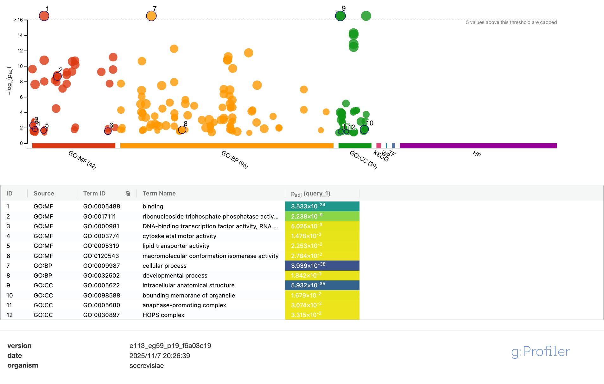

# 🧩 This document records how to perform DNA sequencing alignment
🚨 If you don't believe in me, copy and paste this page into the chat box of an AI you trust to see whether they are correct. I ⚠️**highly recommend**⚠️ you to do this, because I maintain this repo myself, so it is easy for me to make some mistakes.

## 1. Environment Setup
This practive requires the following environment.
```bash
$ conda create -n yeast-align
$ conda activate yeast-align
$ conda install mason art samtools bwa-mem2 bcftools fastqc seqkit multiqc fastp qualimap picard delly snpeff
```

## 2. Get Data
This practice will use data from SGD (Saccharomyces Genome Database).
```bash
$ wget http://sgd-archive.yeastgenome.org/sequence/S288C_reference/S288C_reference_genome_Current_Release.tgz
```

## 3. Unpack and Prepare Reference
Now you have a `.tgz` file in your directory.
```bash
$ tar -xzvf S288C_reference_genome_Current_Release.tgz
```
And you will find a directory named `S288C_reference_genome_R64-5-1_20240529`. We need some of the files from it.
```bash
$ ls S288C_reference_genome_R64-5-1_20240529
gene_association_R64-5-1_20240529.sgd
NotFeature_R64-5-1_20240529.fasta.gz
orf_coding_all_R64-5-1_20240529.fasta.gz
orf_trans_all_R64-5-1_20240529.fasta.gz
other_features_genomic_R64-5-1_20240529.fasta.gz
rna_coding_R64-5-1_20240529.fasta.gz
S288C_reference_sequence_R64-5-1_20240529.fsa.gz
saccharomyces_cerevisiae_R64-5-1_20240529.gff.gz
```
Namely, `S288C_reference_sequence_R64-5-1_20240529.fsa.gz` and `saccharomyces_cerevisiae_R64-5-1_20240529.gff.gz`. Now make the working directory.
```bash
$ mkdir Yeast-Alignment
$ cd Yeast-Alignment
$ mkdir ref_genome
```
You need to move `S288C_reference_sequence_R64-5-1_20240529.fsa.gz` into `ref_genome/` directory. Suppose you are in the newly created directory and the structure is as follows:
```bash
$ ls -p
ref_genome/
$ ls -p ../
S288C_reference_genome_R64-5-1_20240529/
```
Now copy the reference genome into your `ref_genome/` directory.
```bash
$ cp ../S288C_reference_genome_R64-5-1_20240529/S288C_reference_sequence_R64-5-1_20240529.fsa.gz ./ref_genome/
```
Unzip the reference genome.
```bash
$ gunzip ref_genome/S288C_reference_sequence_R64-5-1_20240529.fsa.gz
```

## 4. Prepare VCF
In this practice, we will use simulation reads. Before that, we have to use a program (`mason`) to prepare a VCF file. But `mason` doesn't accept `.fsa` file extension, we need to tweak it a little bit.
```bash
$ mv ref_genome/S288C_reference_sequence_R64-5-1_20240529.fsa ref_genome/S288C_reference_sequence_R64-5-1_20240529.fa
$ samtools faidx ref_genome/S288C_reference_sequence_R64-5-1_20240529.fa
$ mkdir var_call
$ mason_variator -ir ref_genome/S288C_reference_sequence_R64-5-1_20240529.fa -ov var_call/yeast_sim_vars.vcf -of ref_genome/yeast_sim_var_genome.fa --out-breakpoints var_call/yeast_var_breakpoints.tsv --seed 42 --snp-rate 0.0002 --small-indel-rate 0.000002 --sv-indel-rate 0.0000005 --sv-inversion-rate 0.0000005 --sv-translocation-rate 0.0000005 --sv-duplication-rate 0.0000005 --min-sv-size 100 --max-sv-size 2000  
MASON VARIATOR
==============

__OPTIONS_____________________________________________________________________

FASTA IN             	ref_genome/S288C_reference_sequence_R64-5-1_20240529.fa
SV SIZE TSV IN       	
VCF OUT              	var_call/yeast_sim_vars.vcf
FASTA OUT            	ref_genome/yeast_sim_var_genome.fa
BREAKPOINT TSV OUT   	var_call/yeast_var_breakpoints.tsv
METHYLATION IN FILE  	

GENERATE VAR IDS     	YES

NUM HAPLOTYPES       	1
HAPLOTYPE SEP        	"/"

SNP RATE             	0.0002
SMALL INDEL RATE     	2e-06

MIN SMALL INDEL SIZE 	1
MAX SMALL INDEL SIZE 	6

SV INDEL RATE        	5e-07
SV INVERSION RATE    	5e-07
SV TRANSLOCATION RATE	5e-07
SV DUPLICATION RATE  	5e-07

MIN SV SIZE          	100
MAX SV SIZE          	2000

SIM. METHYL. LEVELS  	0
METHYLATION LEVELS
  CG  MU             	0.6
  CG  SIGMA          	0.03
  CHG MU             	0.08
  CHG SIGMA          	0.008
  CHH MU             	0.05
  CHH SIGMA          	0.005


__PREPARATION_________________________________________________________________

Loading Reference Index ref_genome/S288C_reference_sequence_R64-5-1_20240529.fa ... OK (17 seqs)

__SIMULATION__________________________________________________________________


Simulation...
  ref|NC_001133|
  snps:                40
  small indels:        0
  structural variants: 0
  ref|NC_001134|
  snps:                144
  small indels:        2
  structural variants: 1
  ref|NC_001135|
  snps:                64
  small indels:        0
  structural variants: 0
  ref|NC_001136|
  snps:                320
  small indels:        6
  structural variants: 2
  ref|NC_001137|
  snps:                109
  small indels:        0
  structural variants: 2
  ref|NC_001138|
  snps:                50
  small indels:        1
  structural variants: 0
  ref|NC_001139|
  snps:                224
  small indels:        2
  structural variants: 2
  ref|NC_001140|
  snps:                115
  small indels:        1
  structural variants: 1
  ref|NC_001141|
  snps:                92
  small indels:        0
  structural variants: 0
  ref|NC_001142|
  snps:                160
  small indels:        2
  structural variants: 1
  ref|NC_001143|
  snps:                131
  small indels:        1
  structural variants: 1
  ref|NC_001144|
  snps:                218
  small indels:        0
  structural variants: 1
  ref|NC_001145|
  snps:                195
  small indels:        1
  structural variants: 3
  ref|NC_001146|
  snps:                170
  small indels:        0
  structural variants: 0
  ref|NC_001147|
  snps:                201
  small indels:        3
  structural variants: 0
  ref|NC_001148|
  snps:                192
  small indels:        3
  structural variants: 1
  ref|NC_001224|
  snps:                19
  small indels:        0
  structural variants: 0
OK.


DONE.
```
Note that `mason` give us an overall understanding of what variants do we have. It will make it easier for us to analyze the alignment results. You may also want to look at the `.vcf` file.
```bash
$ less -S var_call/yeast_sim_vars.vcf
```
Let's find what does this variant mean.
```bash
$ sed -n '651,656p' var_call/yeast_sim_vars.vcf
ref|NC_001137|	193928	sim_trans_0	A	A[ref|NC_001137|:194736[	.	PASS	SVTYPE=BND	.	1
ref|NC_001137|	193929	sim_trans_0	T	[ref|NC_001137|:194986[T	.	PASS	SVTYPE=BND	.	1
ref|NC_001137|	194735	sim_trans_0	A	A[ref|NC_001137|:194987[	.	PASS	SVTYPE=BND	.	1
ref|NC_001137|	194736	sim_trans_0	A	[ref|NC_001137|:193928[A	.	PASS	SVTYPE=BND	.	1
ref|NC_001137|	194986	sim_trans_0	T	T[ref|NC_001137|:193929[	.	PASS	SVTYPE=BND	.	1
ref|NC_001137|	194987	sim_trans_0	T	[ref|NC_001137|:194735[T	.	PASS	SVTYPE=BND	.	1
```
From the **ID** we can tell that this is a translocation, but it's hard to actually understand it. However, if you look close up, you can find the entries (lines) occur as pairs. Specifically, the first line associates with the fourth line, the second with the fifth, and the third with the sixth. Actually, it isn't that complicated. These intimidating records is due to the conformity to VCF format.
```bash
# Before
......193928-193929......194735-194736......194986-194987......
# After
......193928-194736......194986-193929......194735-194987.....
```
It is a simple exchange between two stretches (193929--194735 and 194736--194986). I hope this crude sketch makes sense.

## 5. Generate Simulation Reads
In order to avoid licence issues, make it easy for us to evaluate alignment results, and keep data size manageable, we will be using simulation reads.
```bash
$ mkdir sim_reads
$ art_illumina -ss HSXn -i ref_genome/yeast_sim_var_genome.fa -p -l 150 -f 30 -m 350 -s 50 -rs 42 -o sim_reads/sim_read

    ====================ART====================
             ART_Illumina (2008-2016)          
          Q Version 2.5.8 (June 6, 2016)       
     Contact: Weichun Huang <whduke@gmail.com> 
    -------------------------------------------

                  Paired-end sequencing simulation

Total CPU time used: 36.3832

The random seed for the run: 42

Parameters used during run
	Read Length:	150
	Genome masking 'N' cutoff frequency: 	1 in 150
	Fold Coverage:            30X
	Mean Fragment Length:     350
	Standard Deviation:       50
	Profile Type:             Combined
	ID Tag:                   

Quality Profile(s)
	First Read:   HiSeqX v2.5 PCR free Length 151 R1 (built-in profile) 
	First Read:   HiSeqX v2.5 PCR free Length 151 R2 (built-in profile) 

Output files

  FASTQ Sequence Files:
	the 1st reads: sim_reads/sim_read1.fq
	the 2nd reads: sim_reads/sim_read2.fq

  ALN Alignment Files:
	the 1st reads: sim_reads/sim_read1.aln
	the 2nd reads: sim_reads/sim_read2.aln
```
I always can not help thinking how clever the developers of these tools are. Sorry for digressing. You may wonder why the log said that the quality profile used is of 151 bp long, but the read length is 150 bp. To be honest, I don't know. Probably for uniformity and universality. The `.aln` file is a kind of alignment results, but it's not a universal format. It contains the original stretch that each read came from and sequencing errors.
```bash
$ sed -n '21,23p' sim_reads/sim_read1.aln
>ref|NC_001133|/1	ref|NC_001133|/1-46020/1-1	75	-
CCACACCACACCCACACACCACACCCTAATACTAACACTAACACTAACACTGACCCAATTCTAACTCCATGTCAACTACCCTCCCTCTCCATCATCACAATCCACGGCACTTACCTCACCACCCCATGCCCTGTCTCATTCCCCCACTCC
CCACACCACACCCACACACCACACCCTAATACTAACACTAACACTAACACTGACCCAATTCTAACTCCATGTCAACTACCCTCCCTCTCCATCATCACATTCCACGGCACTTACCTCACCACCCCATGCCCTGTCTCATTCCCCCACTCC
                                                                                                   ^
```
You can find there is a `A -> T` substitution (marked by `^` manually). This is a sequencinig error rather than a variant.

## 6. Quality Control
Sequencing QC is essential to verify the quality and reliability of the raw data before any analysis. It identifies issues like low-quality bases, adapter contamination, or PCR biases, ensuring that the data is accurate and usable. This step prevents erroneous conclusions and guides the necessary filtering and cleaning of the data.
```bash
$ cd sim_reads/
$ mkdir QC
$ fastqc sim_read1.fq sim_read2.fq -t 8 -o ./QC/
$ fastp -i sim_read1.fq -I sim_read2.fq -h ./QC/fastp.html -j ./QC/fastp.json
Read1 before filtering:
total reads: 1216035
total bases: 182405250
Q20 bases: 178707495(97.9728%)
Q30 bases: 174299528(95.5562%)
Q40 bases: 151886927(83.2689%)

Read2 before filtering:
total reads: 1216035
total bases: 182405250
Q20 bases: 170648446(93.5546%)
Q30 bases: 160578368(88.0339%)
Q40 bases: 128087009(70.2211%)

Read1 after filtering:
total reads: 1216035
total bases: 182383010
Q20 bases: 178686088(97.973%)
Q30 bases: 174278944(95.5566%)
Q40 bases: 151869267(83.2694%)

Read2 after filtering:
total reads: 1216035
total bases: 182383010
Q20 bases: 170628272(93.5549%)
Q30 bases: 160560059(88.0345%)
Q40 bases: 128073218(70.2221%)

Filtering result:
reads passed filter: 2432070
reads failed due to low quality: 0
reads failed due to too many N: 0
reads failed due to too short: 0
reads with adapter trimmed: 816
bases trimmed due to adapters: 44480

Duplication rate: 0.0155423%

Insert size peak (evaluated by paired-end reads): 268

JSON report: ./QC/fastp.json
HTML report: ./QC/fastp.html

fastp -i sim_read1.fq -I sim_read2.fq -h ./QC/fastp.html -j ./QC/fastp.json 
fastp v1.0.1, time used: 5 seconds
$ cd QC/
$ multiqc .
$ open multiqc_report.html
```
This is a basic QC. Note that we are generating QC report, rather than cleaning up our data. The raw `.fq` files are intact up to now. Now your browser is opened. You can go to read the QC report. The `.html` file generated by `multiqc` is really intuitive. You can explore this report by yourself. The most important section in this case is probably **Adapter Content**. The graph seems like an increasing straight line at first glance, which is very intimidating. However, the highest point is only of less than 1%. If you hover the cursor around the lines, you can see that a pop-up window on which "polya" is written. What happened? I am not sure, but probably because it reveals the features of yeast genome, that there are natural simple `A` repeats evenly distributed in the whole genome, which has been recognized as "polya" by the software. Another useful index is **Sequence Quality Histograms**. Our simulation reads have very high qualities, so we don't need to trim. You may notice that `fastp` reported that `816` reads are trimmed due to adapters. However, by comparison with the total number of reads, it is an extremely small number, so they just happen to have the same sequences as adapters. There is no adapter in our simulation reads actually. But to put this workflow more complete, we will still try to do some filtering and cleaning.
```bash
$ cd ..
$ mkdir cleaned_QC
$ fastp -i sim_read1.fq -I sim_read2.fq -o clean_sim_read1.fq -O clean_sim_read2.fq --cut_front --cut_tail --length_required 50 -w 8 -h ./cleaned_QC/fastp.html -j ./cleaned_QC/fastp.json
Read1 before filtering:
total reads: 1216035
total bases: 182405250
Q20 bases: 178707495(97.9728%)
Q30 bases: 174299528(95.5562%)
Q40 bases: 151886927(83.2689%)

Read2 before filtering:
total reads: 1216035
total bases: 182405250
Q20 bases: 170648446(93.5546%)
Q30 bases: 160578368(88.0339%)
Q40 bases: 128087009(70.2211%)

Read1 after filtering:
total reads: 1215978
total bases: 182372992
Q20 bases: 178681070(97.9756%)
Q30 bases: 174274775(95.5595%)
Q40 bases: 151866244(83.2723%)

Read2 after filtering:
total reads: 1215978
total bases: 182196135
Q20 bases: 170550048(93.6079%)
Q30 bases: 160503889(88.094%)
Q40 bases: 128060270(70.287%)

Filtering result:
reads passed filter: 2431956
reads failed due to low quality: 0
reads failed due to too many N: 0
reads failed due to too short: 114
reads with adapter trimmed: 820
bases trimmed due to adapters: 44861

Duplication rate: 0.0155423%

Insert size peak (evaluated by paired-end reads): 269

JSON report: ./cleaned_QC/fastp.json
HTML report: ./cleaned_QC/fastp.html

fastp -i sim_read1.fq -I sim_read2.fq -o clean_sim_read1.fq -O clean_sim_read2.fq --cut_front --cut_tail --length_required 50 -w 8 -h ./cleaned_QC/fastp.html -j ./cleaned_QC/fastp.json 
fastp v1.0.1, time used: 2 seconds
```
The report is different. It seems that we have `114` reads shorter than 50 bp. Let's complete QC report.
```bash
$ fastqc clean_sim_read1.fq clean_sim_read2.fq -t 8 -o ./cleaned_QC/
$ cd cleaned_QC/
$ multiqc .
$ open multiqc_report.html
```
What's the difference in QC report after cleaning? I found that the only obvious change is that the reads' lengths are not uniformly 150 bp. This means that `fastp` trimmed off some bases due to their similarities to the adapters. We know that we don't have adapters in the simulation reads, so it seems to be a bad practice. However, we cannot avoid this in reality, so we will keep the trimmed reads.

## 7. Alignment
Go to the home working directory.
```bash
$ cd ../../
$ ls -p
sim_reads/		var_call/		ref_genome/
```
We need to index the original reference genome. Remember we are going to use the original genome as the reference rather than the one with variants.
```bash
$ bwa-mem2 index ref_genome/S288C_reference_sequence_R64-5-1_20240529.fa
[bwa_index] Pack FASTA... 0.05 sec
* Entering FMI_search
init ticks = 4472751
ref seq len = 24314210
binary seq ticks = 3761768
build suffix-array ticks = 25119444
ref_seq_len = 24314210
count = 0, 7519429, 12157105, 16794781, 24314210
BWT[9222394] = 4
CP_SHIFT = 6, CP_MASK = 63
sizeof CP_OCC = 64
pos: 3039277, ref_seq_len__: 3039276
max_occ_ind = 379909
build fm-index ticks = 8740931
Total time taken: 1.8015
```
Perform alignment.
```bash
$ mkdir align
$ bwa-mem2 mem -t 8 ref_genome/S288C_reference_sequence_R64-5-1_20240529.fa sim_reads/clean_sim_read1.fq sim_reads/clean_sim_read2.fq | samtools sort -o align/yeast_align.bam
-----------------------------
Executing in AVX mode!!
-----------------------------
* SA compression enabled with xfactor: 8
* Ref file: ref_genome/S288C_reference_sequence_R64-5-1_20240529.fa
* Entering FMI_search
* Index file found. Loading index from ref_genome/S288C_reference_sequence_R64-5-1_20240529.fa.bwt.2bit.64
* Reference seq len for bi-index = 24314211
* sentinel-index: 9222394
* Count:
0,	1
1,	7519430
2,	12157106
3,	16794782
4,	24314211

* Reading other elements of the index from files ref_genome/S288C_reference_sequence_R64-5-1_20240529.fa
* Index prefix: ref_genome/S288C_reference_sequence_R64-5-1_20240529.fa
* Read 0 ALT contigs
* Done reading Index!!
* Reading reference genome..
* Binary seq file = ref_genome/S288C_reference_sequence_R64-5-1_20240529.fa.0123
* Reference genome size: 24314210 bp
* Done reading reference genome !!

------------------------------------------
1. Memory pre-allocation for Chaining: 1114.7223 MB
2. Memory pre-allocation for BSW: 1916.9362 MB
3. Memory pre-allocation for BWT: 618.5134 MB
------------------------------------------
* Threads used (compute): 8
* No. of pipeline threads: 2

[0000] read_chunk: 80000000, work_chunk_size: 80000060, nseq: 533688
	[0000][ M::kt_pipeline] read 533688 sequences (80000060 bp)...
[0000] Reallocating initial memory allocations!!
[0000] Calling mem_process_seqs.., task: 0
[0000] 1. Calling kt_for - worker_bwt
[0000] read_chunk: 80000000, work_chunk_size: 80000153, nseq: 533642
	[0000][ M::kt_pipeline] read 533642 sequences (80000153 bp)...
[0000] 2. Calling kt_for - worker_aln
[0000] Inferring insert size distribution of PE reads from data, l_pac: 12157105, n: 533688
[0000][PE] # candidate unique pairs for (FF, FR, RF, RR): (0, 245134, 14, 0)
[0000][PE] skip orientation FF as there are not enough pairs
[0000][PE] analyzing insert size distribution for orientation FR...
[0000][PE] (25, 50, 75) percentile: (315, 348, 382)
[0000][PE] low and high boundaries for computing mean and std.dev: (181, 516)
[0000][PE] mean and std.dev: (348.44, 49.75)
[0000][PE] low and high boundaries for proper pairs: (114, 583)
[0000][PE] analyzing insert size distribution for orientation RF...
[0000][PE] (25, 50, 75) percentile: (600, 621, 687)
[0000][PE] low and high boundaries for computing mean and std.dev: (426, 861)
[0000][PE] mean and std.dev: (640.07, 46.47)
[0000][PE] low and high boundaries for proper pairs: (339, 948)
[0000][PE] skip orientation RR as there are not enough pairs
[0000][PE] skip orientation RF
[0000] 3. Calling kt_for - worker_sam
	[0000][ M::mem_process_seqs] Processed 533688 reads in 21.247 CPU sec, 2.668 real sec
[0000] Calling mem_process_seqs.., task: 1
[0000] 1. Calling kt_for - worker_bwt
[0000] read_chunk: 80000000, work_chunk_size: 80000018, nseq: 533696
	[0000][ M::kt_pipeline] read 533696 sequences (80000018 bp)...
[0000] 2. Calling kt_for - worker_aln
[0000] Inferring insert size distribution of PE reads from data, l_pac: 12157105, n: 533642
[0000][PE] # candidate unique pairs for (FF, FR, RF, RR): (17, 247334, 62, 24)
[0000][PE] analyzing insert size distribution for orientation FF...
[0000][PE] (25, 50, 75) percentile: (934, 1002, 1157)
[0000][PE] low and high boundaries for computing mean and std.dev: (488, 1603)
[0000][PE] mean and std.dev: (998.76, 132.67)
[0000][PE] low and high boundaries for proper pairs: (265, 1826)
[0000][PE] analyzing insert size distribution for orientation FR...
[0000][PE] (25, 50, 75) percentile: (315, 349, 382)
[0000][PE] low and high boundaries for computing mean and std.dev: (181, 516)
[0000][PE] mean and std.dev: (348.50, 49.83)
[0000][PE] low and high boundaries for proper pairs: (114, 583)
[0000][PE] analyzing insert size distribution for orientation RF...
[0000][PE] (25, 50, 75) percentile: (719, 1501, 3059)
[0000][PE] low and high boundaries for computing mean and std.dev: (1, 7739)
[0000][PE] mean and std.dev: (1787.26, 1020.83)
[0000][PE] low and high boundaries for proper pairs: (1, 10079)
[0000][PE] analyzing insert size distribution for orientation RR...
[0000][PE] (25, 50, 75) percentile: (920, 994, 1041)
[0000][PE] low and high boundaries for computing mean and std.dev: (678, 1283)
[0000][PE] mean and std.dev: (983.00, 88.68)
[0000][PE] low and high boundaries for proper pairs: (557, 1404)
[0000][PE] skip orientation FF
[0000][PE] skip orientation RF
[0000][PE] skip orientation RR
[0000] 3. Calling kt_for - worker_sam
	[0000][ M::mem_process_seqs] Processed 533642 reads in 21.956 CPU sec, 2.737 real sec
[0000] Reallocating initial memory allocations!!
[0000] Calling mem_process_seqs.., task: 2
[0000] 1. Calling kt_for - worker_bwt
[0000] read_chunk: 80000000, work_chunk_size: 80000181, nseq: 533638
	[0000][ M::kt_pipeline] read 533638 sequences (80000181 bp)...
[0000] 2. Calling kt_for - worker_aln
[0000] Inferring insert size distribution of PE reads from data, l_pac: 12157105, n: 533696
[0000][PE] # candidate unique pairs for (FF, FR, RF, RR): (0, 247559, 1, 0)
[0000][PE] skip orientation FF as there are not enough pairs
[0000][PE] analyzing insert size distribution for orientation FR...
[0000][PE] (25, 50, 75) percentile: (315, 348, 382)
[0000][PE] low and high boundaries for computing mean and std.dev: (181, 516)
[0000][PE] mean and std.dev: (348.27, 49.69)
[0000][PE] low and high boundaries for proper pairs: (114, 583)
[0000][PE] skip orientation RF as there are not enough pairs
[0000][PE] skip orientation RR as there are not enough pairs
[0000] 3. Calling kt_for - worker_sam
	[0000][ M::mem_process_seqs] Processed 533696 reads in 20.413 CPU sec, 2.546 real sec
[0000] Calling mem_process_seqs.., task: 3
[0000] 1. Calling kt_for - worker_bwt
[0000] read_chunk: 80000000, work_chunk_size: 44568715, nseq: 297292
	[0000][ M::kt_pipeline] read 297292 sequences (44568715 bp)...
[0000] 2. Calling kt_for - worker_aln
[0000] Inferring insert size distribution of PE reads from data, l_pac: 12157105, n: 533638
[0000][PE] # candidate unique pairs for (FF, FR, RF, RR): (0, 250160, 46, 0)
[0000][PE] skip orientation FF as there are not enough pairs
[0000][PE] analyzing insert size distribution for orientation FR...
[0000][PE] (25, 50, 75) percentile: (315, 349, 382)
[0000][PE] low and high boundaries for computing mean and std.dev: (181, 516)
[0000][PE] mean and std.dev: (348.44, 49.77)
[0000][PE] low and high boundaries for proper pairs: (114, 583)
[0000][PE] analyzing insert size distribution for orientation RF...
[0000][PE] (25, 50, 75) percentile: (400, 2602, 2701)
[0000][PE] low and high boundaries for computing mean and std.dev: (1, 7303)
[0000][PE] mean and std.dev: (1543.83, 1157.84)
[0000][PE] low and high boundaries for proper pairs: (1, 9604)
[0000][PE] skip orientation RR as there are not enough pairs
[0000][PE] skip orientation RF
[0000] 3. Calling kt_for - worker_sam
	[0000][ M::mem_process_seqs] Processed 533638 reads in 20.961 CPU sec, 2.622 real sec
[0000] Calling mem_process_seqs.., task: 4
[0000] 1. Calling kt_for - worker_bwt
[0000] read_chunk: 80000000, work_chunk_size: 0, nseq: 0
[0000] 2. Calling kt_for - worker_aln
[0000] Inferring insert size distribution of PE reads from data, l_pac: 12157105, n: 297292
[0000][PE] # candidate unique pairs for (FF, FR, RF, RR): (0, 139674, 0, 0)
[0000][PE] skip orientation FF as there are not enough pairs
[0000][PE] analyzing insert size distribution for orientation FR...
[0000][PE] (25, 50, 75) percentile: (314, 348, 382)
[0000][PE] low and high boundaries for computing mean and std.dev: (178, 518)
[0000][PE] mean and std.dev: (348.33, 49.86)
[0000][PE] low and high boundaries for proper pairs: (110, 586)
[0000][PE] skip orientation RF as there are not enough pairs
[0000][PE] skip orientation RR as there are not enough pairs
[0000] 3. Calling kt_for - worker_sam
	[0000][ M::mem_process_seqs] Processed 297292 reads in 11.681 CPU sec, 1.459 real sec
[0000] read_chunk: 80000000, work_chunk_size: 0, nseq: 0
[0000] Computation ends..
No. of OMP threads: 8
Processor is running @24.120790 MHz
Runtime profile:

	Time taken for main_mem function: 14.15 sec

	IO times (sec) :
	Reading IO time (reads) avg: 0.67, (0.67, 0.67)
	Writing IO time (SAM) avg: 2.75, (2.75, 2.75)
	Reading IO time (Reference Genome) avg: 0.01, (0.01, 0.01)
	Index read time avg: 0.01, (0.01, 0.01)

	Overall time (sec) (Excluding Index reading time):
	PROCESS() (Total compute time + (read + SAM) IO time) : 14.13
	MEM_PROCESS_SEQ() (Total compute time (Kernel + SAM)), avg: 11.97, (11.97, 11.97)

	SAM Processing time (sec):
	--WORKER_SAM avg: 1.74, (1.74, 1.74)

	Kernels' compute time (sec):
	Total kernel (smem+sal+bsw) time avg: 10.16, (10.16, 10.16)
		SMEM compute avg: 3.59, (3.60, 3.58)
		SAL compute avg: 0.66, (0.67, 0.66)
				MEM_SA avg: 0.50, (0.50, 0.49)

		BSW time, avg: 5.77, (5.77, 5.76)

Important parameter settings: 
	BATCH_SIZE: 512
	MAX_SEQ_LEN_REF: 256
	MAX_SEQ_LEN_QER: 128
	MAX_SEQ_LEN8: 128
	SEEDS_PER_READ: 500
	SIMD_WIDTH8 X: 16
	SIMD_WIDTH16 X: 8
	AVG_SEEDS_PER_READ: 64
[bam_sort_core] merging from 1 files and 1 in-memory blocks...
```
Index the `.bam` file for visualization.
```bash
$ samtools index align/yeast_align.bam
```

## 8. QC for Alignment
We will leave the terminal soon. I promise. Let's take a quick glance of the alignment results. Recall the format of SAM/BAM.
```bash
$ samtools view -h align/yeast_align.bam | head -n 25
@HD	VN:1.6	SO:coordinate
@SQ	SN:ref|NC_001133|	LN:230218
@SQ	SN:ref|NC_001134|	LN:813184
@SQ	SN:ref|NC_001135|	LN:316620
@SQ	SN:ref|NC_001136|	LN:1531933
@SQ	SN:ref|NC_001137|	LN:576874
@SQ	SN:ref|NC_001138|	LN:270161
@SQ	SN:ref|NC_001139|	LN:1090940
@SQ	SN:ref|NC_001140|	LN:562643
@SQ	SN:ref|NC_001141|	LN:439888
@SQ	SN:ref|NC_001142|	LN:745751
@SQ	SN:ref|NC_001143|	LN:666816
@SQ	SN:ref|NC_001144|	LN:1078177
@SQ	SN:ref|NC_001145|	LN:924431
@SQ	SN:ref|NC_001146|	LN:784333
@SQ	SN:ref|NC_001147|	LN:1091291
@SQ	SN:ref|NC_001148|	LN:948066
@SQ	SN:ref|NC_001224|	LN:85779
@PG	ID:bwa-mem2	PN:bwa-mem2	VN:2.2.1	CL:bwa-mem2 mem -t 8 ref_genome/S288C_reference_sequence_R64-5-1_20240529.fa sim_reads/clean_sim_read1.fq sim_reads/clean_sim_read2.fq
@PG	ID:samtools	PN:samtools	PP:bwa-mem2	VN:1.22.1	CL:samtools sort -o align/yeast_align.bam
@PG	ID:samtools.1	PN:samtools	PP:samtools	VN:1.22.1	CL:samtools view -h align/yeast_align.bam
ref|NC_001133|/1-26356	99	ref|NC_001133|	11	60	150M	=	228	367CCCACACACCCACACACCACACCACACACCACACCACACCCACACACACACATCCTAACACTACCCTAACACAGCCCTAATCTAACCCTGGCCAACCTGTCTCTCAACTTACCCTCCATTACCCTGCCTCCCCTCGTTACCCTCTCCCAT	FAFFFKKKKKKKKKFKKKKKKKKKKKKFKKKKKKK,KFKKKKKKKKKKKKKKKKKKKKKKKKKKKFKKKKKKKKKKKKKKKKKKKKKKKKKKKFF<KKF7<KKKKFAKKKKKKKKKKKKKKKKKKKK<KK7,AKKKKKK<KKK7KKFKKF	NM:i:2	MD:Z:131A11G6	MC:Z:150M	AS:i:140	XS:i:45
ref|NC_001133|/1-13336	99	ref|NC_001133|	15	60	150M	=	216	351CACACCCACACACCACACCACACACCACACCACACCCACACACACACATCCTAACACTACCCTAACACAGCCCTAATCTAACCCTGGCCAACCTGTCTCTCAACTTACCCTCCATTACCCTGCCTCCACTCGTTACCCTGTCCCATTCAA	FAFFFKKKKKKKKKKKFFKKKKKKKKKKKKKKKKKKKKKFKKKKKKKKKKKKKKKKKFKKKKKKKKKKKK,KKKKKKKKKKKKKKKKKKKKKKKKFKKKKKKKKKKK7KKKKK,KFKKKKKKKAKKKKAKFKKKKKFKKKKFKF<FKK<F	NM:i:0	MD:Z:150	MC:Z:150M	AS:i:150	XS:i:52
ref|NC_001133|/1-30472	163	ref|NC_001133|	17	60	150M	=	234	367CACCCACACACCACACCACACACCACACCACACCCACACACACACATCCTAACACTACCCTAACACAGTCCTAATCTAACCCTGGCCAACCTGTCTCTCAACTTACCCTCCATTACCCTGCCTCCACTCGTTACCCTGTCCCATTCAACC	AA<FFKKKKKKKKKKKKAKK<KKKKKKKKKKKKKKKKKKKKKKKFKKKK,KKKKKKKKA,,FKKKKKK,KKKKKK<KKFKKKKKKKKKKFKKKKFAAKKKKFK7KKKKKKKKKKK(KFKKKKK7(AFKKKKKKAKKFFKKKK,KKK7K,K	NM:i:1	MD:Z:68C81	MC:Z:150M	AS:i:145	XS:i:46
ref|NC_001133|/1-3144	163	ref|NC_001133|	19	60	150M	=	227	358CCCACACACCACACCACACACCACACCACACCCACACACACACATCCTAACACTACCCTAACACAGCCCTAATCTAACCCTGGCCAACCTGTATCTCAACTTACCCTCGATTACCCTGCCCCCACTCGTTACCCTGTCCCATTCAACCAT	<AAFFKKKK(KKKKKKKKKKKKKKAKKKKKFKKKKKKKKKKK7KKKKKKKAKKAKKKKKKKKKKKK7KK7KFKKKKAKKKAKKFKKAFKKKK(,,KKK7KKKK(,KK<<KKKFK<KKK,K,FKKKF,KKK,7<KKFK<K7F7KKKF7FFK	NM:i:3	MD:Z:92C15C11T29	MC:Z:150M	AS:i:135	XS:i:25
```
Of course `.bam` is a huge file. We cannot check it by eye. We will turn to `samtools` and **FLAG**.
```bash
$ samtools flagstat align/yeast_align.bam
2432337 + 0 in total (QC-passed reads + QC-failed reads)
2431956 + 0 primary
0 + 0 secondary
381 + 0 supplementary
0 + 0 duplicates
0 + 0 primary duplicates
2431807 + 0 mapped (99.98% : N/A)
2431426 + 0 primary mapped (99.98% : N/A)
2431956 + 0 paired in sequencing
1215978 + 0 read1
1215978 + 0 read2
2430328 + 0 properly paired (99.93% : N/A)
2431236 + 0 with itself and mate mapped
190 + 0 singletons (0.01% : N/A)
82 + 0 with mate mapped to a different chr
26 + 0 with mate mapped to a different chr (mapQ>=5)
```
The alignment quality is also really high, which gives us great confidence. Also check the sequencing depth.
```bash
$ samtools depth align/yeast_align.bam | awk '{sum+=$3} END {print "sequencing depth:", sum/NR}'
sequencing depth: 29.9843
```
Another stats for alignment results.
```bash
$ samtools idxstats align/yeast_align.bam
ref|NC_001133|	230218	46128	0
ref|NC_001134|	813184	162912	0
ref|NC_001135|	316620	63310	0
ref|NC_001136|	1531933	306746	35
ref|NC_001137|	576874	115401	0
ref|NC_001138|	270161	53955	0
ref|NC_001139|	1090940	218141	37
ref|NC_001140|	562643	112820	0
ref|NC_001141|	439888	87992	0
ref|NC_001142|	745751	149189	37
ref|NC_001143|	666816	133277	0
ref|NC_001144|	1078177	215255	0
ref|NC_001145|	924431	185087	49
ref|NC_001146|	784333	156700	0
ref|NC_001147|	1091291	218192	0
ref|NC_001148|	948066	189578	32
ref|NC_001224|	85779	17124	0
*	0	0	340
```
The four columns are sequence name, sequence length, mapped reads, and unmapped reads, respectively. Note that the total number of unmapped reads is greater than the sum of unmapped reads of each chromosome. We also have a very sophisticated tool.
```bash
$ qualimap bamqc -bam align/yeast_align.bam -c -sd -outdir align/QC/qualimap -outformat HTML 
$ open align/QC/qualimap/qualimapReport.html
```
Note that there are some nuanced differences between the report generated by `qualimap` and `samtools` (e.g. unmapped reads). This is because the definition used by the tools is different. I reckon that `qualimap` counted singletons as unmapped in this case.

## 9. Variant Calling
Finally, we are arriving at variant calling. You may have noticed that there are some duplicates reported by `qualimap`. Although there are biological duplicates, which should have been taken into account in variant calling, we still want to mark the duplicates for conservative considerations.
```bash
$ samtools sort -@ 8 -n align/yeast_align.bam -o align/yeast_align_namesort.bam
$ samtools fixmate -@ 8 -m align/yeast_align_namesort.bam align/yeast_align_fixmate.bam
$ samtools sort -@ 8 align/yeast_align_fixmate.bam -o align/yeast_align_coordsort.bam
$ samtools markdup -@ 8 -s align/yeast_align_coordsort.bam align/yeast_align_markdup.bam
COMMAND: samtools markdup -@ 8 -s align/yeast_align_coordsort.bam align/yeast_align_markdup.bam
READ: 2432337
WRITTEN: 2432337
EXCLUDED: 911
EXAMINED: 2431426
PAIRED: 2431236
SINGLE: 190
DUPLICATE PAIR: 692
DUPLICATE SINGLE: 21
DUPLICATE PAIR OPTICAL: 0
DUPLICATE SINGLE OPTICAL: 0
DUPLICATE NON PRIMARY: 0
DUPLICATE NON PRIMARY OPTICAL: 0
DUPLICATE PRIMARY TOTAL: 713
DUPLICATE TOTAL: 713
ESTIMATED_LIBRARY_SIZE: 2135038592
$ samtools flagstat  align/yeast_align_markdup.bam
2432337 + 0 in total (QC-passed reads + QC-failed reads)
2431956 + 0 primary
0 + 0 secondary
381 + 0 supplementary
713 + 0 duplicates
713 + 0 primary duplicates
2431807 + 0 mapped (99.98% : N/A)
2431426 + 0 primary mapped (99.98% : N/A)
2431956 + 0 paired in sequencing
1215978 + 0 read1
1215978 + 0 read2
2430328 + 0 properly paired (99.93% : N/A)
2431236 + 0 with itself and mate mapped
190 + 0 singletons (0.01% : N/A)
82 + 0 with mate mapped to a different chr
26 + 0 with mate mapped to a different chr (mapQ>=5)
```
Now we have duplicates marked. We have very little duplicates, which is great. However, it is way smaller than the estimated duplicates provided by `qualimap`, and I don't know why. If somebody happens to read this text and know the answer, please leave an issue. Thank you very much. We can try to mark duplicate again with `picard` to verify this result.
```bash
$ samtools addreplacerg -r "@RG\tID:yeast\tSM:yeast\tPL:art_illumina" -o align/yeast_align_rg.bam align/yeast_align.bam
$ picard MarkDuplicates -I align/yeast_align_rg.bam -O align/yeast_align_markdup_picard.bam -M align/yeast_align_picard_metrics.txt --CREATE_INDEX true --VALIDATION_STRINGENCY SILENT
$ samtools flagstat align/yeast_align_markdup_picard.bam
2432337 + 0 in total (QC-passed reads + QC-failed reads)
2431956 + 0 primary
0 + 0 secondary
381 + 0 supplementary
713 + 0 duplicates
713 + 0 primary duplicates
2431807 + 0 mapped (99.98% : N/A)
2431426 + 0 primary mapped (99.98% : N/A)
2431956 + 0 paired in sequencing
1215978 + 0 read1
1215978 + 0 read2
2430328 + 0 properly paired (99.93% : N/A)
2431236 + 0 with itself and mate mapped
190 + 0 singletons (0.01% : N/A)
82 + 0 with mate mapped to a different chr
26 + 0 with mate mapped to a different chr (mapQ>=5)
```
Number of duplicates is the same. Let's call variants. I will use the file generated by `samtools` here.
```bash
$ samtools index align/yeast_align_markdup.bam
$ bcftools mpileup -f ref_genome/S288C_reference_sequence_R64-5-1_20240529.fa align/yeast_align_markdup.bam -Ou > var_call/yeast_mpileup.bcf
```
This command piles up almost each base. It takes all the information of the reads that cover a certain base position into account, and generate what base appears in our sample at each position. Now call the variants.
```bash
$ bcftools call -mv --ploidy 1 -Oz -o var_call/yeast_raw_var.vcf.gz var_call/yeast_mpileup.bcf
$ bcftools call -cv --ploidy 1 -Oz -o var_call/yeast_raw_var_consensus.vcf.gz var_call/yeast_mpileup.bcf
$ bcftools view var_call/yeast_raw_var.vcf.gz | grep '^ref' | wc -l
    2400
$ bcftools view var_call/yeast_raw_var_consensus.vcf.gz | grep '^ref' | wc -l
    2400
$ grep '^ref' var_call/yeast_sim_vars.vcf | grep -e snp -e small_indel | wc -l
    2466
```
It seems like even with very high quality simulation reads we still cannot call the variants perfectly. Now it comes to SV.
```bash
$ delly call -g ref_genome/S288C_reference_sequence_R64-5-1_20240529.fa -o var_call/yeast_delly_call.bcf align/yeast_align_markdup.bam
[2025-Nov-06 12:43:26] delly call -g ref_genome/S288C_reference_sequence_R64-5-1_20240529.fa -o var_call/yeast_delly_call.bcf align/yeast_align_markdup.bam 
[2025-Nov-06 12:43:26] Paired-end and split-read scanning
[2025-Nov-06 12:43:27] Split-read clustering
[2025-Nov-06 12:43:27] Paired-end clustering
[2025-Nov-06 12:43:27] Split-read assembly
[2025-Nov-06 12:43:27] Generate REF and ALT probes
[2025-Nov-06 12:43:27] SV annotation
[2025-Nov-06 12:43:28] Genotyping
[2025-Nov-06 12:43:28] Sample statistics
Sample:yeast_align_markdup,ReadSize=150,Median=350,MAD=34,UniqueDiscordantPairs=386
[2025-Nov-06 12:43:28] Done.
```
`delly` assumes diploidy when genotyping, however, we know that our yeast is haploid, so we can ignore `GT` (genotype). Check the results first.
```bash
$ bcftools view -H var_call/yeast_delly_call.bcf | cut -d $'\t' -f 1 | sort | uniq
ref|NC_001136|
ref|NC_001137|
ref|NC_001139|
ref|NC_001140|
ref|NC_001143|
ref|NC_001144|
ref|NC_001145|
$ bcftools view -H var_call/yeast_sim_vars.vcf | cut -d $'\t' -f 1,3 | grep -v -e snp -e small_indel | cut -d $'\t' -f 1 | sort | uniq
ref|NC_001134|
ref|NC_001136|
ref|NC_001137|
ref|NC_001139|
ref|NC_001140|
ref|NC_001142|
ref|NC_001143|
ref|NC_001144|
ref|NC_001145|
ref|NC_001148|
```
At least we didn't find SVs on chromosomes that actually have no SVs, but still not very efficient. We may visualize the alignment results with SVs later. Now simply ignore the SVs.

## 10. QC for Variant Calling
First let's see what indices are provided.
```bash
$ bcftools view -h var_call/yeast_raw_var.vcf.gz | grep -e INFO -e FORMAT | sed 's/^##//'
INFO=<ID=INDEL,Number=0,Type=Flag,Description="Indicates that the variant is an INDEL.">
INFO=<ID=IDV,Number=1,Type=Integer,Description="Maximum number of raw reads supporting an indel">
INFO=<ID=IMF,Number=1,Type=Float,Description="Maximum fraction of raw reads supporting an indel">
INFO=<ID=DP,Number=1,Type=Integer,Description="Raw read depth">
INFO=<ID=VDB,Number=1,Type=Float,Description="Variant Distance Bias for filtering splice-site artefacts in RNA-seq data (bigger is better)",Version="3">
INFO=<ID=RPBZ,Number=1,Type=Float,Description="Mann-Whitney U-z test of Read Position Bias (closer to 0 is better)">
INFO=<ID=MQBZ,Number=1,Type=Float,Description="Mann-Whitney U-z test of Mapping Quality Bias (closer to 0 is better)">
INFO=<ID=BQBZ,Number=1,Type=Float,Description="Mann-Whitney U-z test of Base Quality Bias (closer to 0 is better)">
INFO=<ID=MQSBZ,Number=1,Type=Float,Description="Mann-Whitney U-z test of Mapping Quality vs Strand Bias (closer to 0 is better)">
INFO=<ID=SCBZ,Number=1,Type=Float,Description="Mann-Whitney U-z test of Soft-Clip Length Bias (closer to 0 is better)">
INFO=<ID=SGB,Number=1,Type=Float,Description="Segregation based metric, http://samtools.github.io/bcftools/rd-SegBias.pdf">
INFO=<ID=MQ0F,Number=1,Type=Float,Description="Fraction of MQ0 reads (smaller is better)">
FORMAT=<ID=PL,Number=G,Type=Integer,Description="List of Phred-scaled genotype likelihoods">
FORMAT=<ID=AD,Number=R,Type=Integer,Description="Allelic depths (high-quality bases)">
FORMAT=<ID=GT,Number=1,Type=String,Description="Genotype">
INFO=<ID=AC,Number=A,Type=Integer,Description="Allele count in genotypes for each ALT allele, in the same order as listed">
INFO=<ID=AN,Number=1,Type=Integer,Description="Total number of alleles in called genotypes">
INFO=<ID=DP4,Number=4,Type=Integer,Description="Number of high-quality ref-forward , ref-reverse, alt-forward and alt-reverse bases">
INFO=<ID=MQ,Number=1,Type=Integer,Description="Average mapping quality">
#CHROM	POS	ID	REF	ALT	QUAL	FILTER	INFO	FORMAT	align/yeast_align_markdup.bam
```
A very common filtering.
```bash
$ bcftools filter -i 'QUAL>=30 && DP>=10 && MQ>=40 && MQ0F<=0.1' var_call/yeast_raw_var.vcf.gz -Oz -o var_call/yeast_filtered.vcf.gz
$ bcftools view -H var_call/yeast_filtered.vcf.gz | wc -l
    2351
```
Also we have the QC report
```bash
$ mkdir var_call/QC
$ bcftools stats var_call/yeast_filtered.vcf.gz > var_call/QC/yeast_var_stats.txt
$ cd var_call/QC/
$ multiqc .
$ open multiqc_report.html
```
Note that the Ts/Tv ratio is 0.47. What's the difference of this index between our simulation data and the real data? This ratio reveals that the substitution occurs randomly. This is the only really weird thing I could find. If you find any other interpretations of this QC report, please leave an issue.

## 11. Annotation
We need to make the symbols consistent. I forget why did we use accession number as the ID of the chromosome, but we have to tweak the `.gff` file.
```bash
$ cd ../../
$ mkdir -p snpeff/data/SC_SGD
$ cp ../S288C_reference_genome_R64-5-1_20240529/S288C_reference_sequence_R64-5-1_20240529.fsa.gz ./snpeff/data/SC_SGD/
$ cp ../S288C_reference_genome_R64-5-1_20240529/saccharomyces_cerevisiae_R64-5-1_20240529.gff.gz ./snpeff/data/SC_SGD/
$ gunzip snpeff/data/SC_SGD/*
$ mv snpeff/data/SC_SGD/S288C_reference_sequence_R64-5-1_20240529.fsa snpeff/data/SC_SGD/sequences.fa
```
GFF file provided by SGD contains sequences. Remove them.
```bash
$ sed -n '/^###/q; p' snpeff/data/SC_SGD/saccharomyces_cerevisiae_R64-5-1_20240529.gff > snpeff/data/SC_SGD/genes.gff
$ rm snpeff/data/SC_SGD/saccharomyces_cerevisiae_R64-5-1_20240529.gff
$ seqkit seq -n snpeff/data/SC_SGD/sequences.fa | cut -d ' ' -f 1,6
ref|NC_001133| [chromosome=I]
ref|NC_001134| [chromosome=II]
ref|NC_001135| [chromosome=III]
ref|NC_001136| [chromosome=IV]
ref|NC_001137| [chromosome=V]
ref|NC_001138| [chromosome=VI]
ref|NC_001139| [chromosome=VII]
ref|NC_001140| [chromosome=VIII]
ref|NC_001141| [chromosome=IX]
ref|NC_001142| [chromosome=X]
ref|NC_001143| [chromosome=XI]
ref|NC_001144| [chromosome=XII]
ref|NC_001145| [chromosome=XIII]
ref|NC_001146| [chromosome=XIV]
ref|NC_001147| [chromosome=XV]
ref|NC_001148| [chromosome=XVI]
ref|NC_001224| [location=mitochondrion]
$ touch replace_symbol.sh
```
Open your text editor and write the following code into `replace_symbol.sh`.
```bash
awk -F'\t' '
NR>=22 {
	if ($1 == "chrI") $1 = "ref|NC_001133|"
	else if ($1 == "chrII") $1 = "ref|NC_001134|"
	else if ($1 == "chrIII") $1 = "ref|NC_001135|"
	else if ($1 == "chrIV") $1 = "ref|NC_001136|"
	else if ($1 == "chrV") $1 = "ref|NC_001137|"
	else if ($1 == "chrVI") $1 = "ref|NC_001138|"
	else if ($1 == "chrVII") $1 = "ref|NC_001139|"
	else if ($1 == "chrVIII") $1 = "ref|NC_001140|"
	else if ($1 == "chrIX") $1 = "ref|NC_001141|"
	else if ($1 == "chrX") $1 = "ref|NC_001142|"
	else if ($1 == "chrXI") $1 = "ref|NC_001143|"
	else if ($1 == "chrXII") $1 = "ref|NC_001144|"
	else if ($1 == "chrXIII") $1 = "ref|NC_001145|"
	else if ($1 == "chrXIV") $1 = "ref|NC_001146|"
	else if ($1 == "chrXV") $1 = "ref|NC_001147|"
	else if ($1 == "chrXVI") $1 = "ref|NC_001148|"
	else $1 = "ref|NC_001224|"
}
{print}' OFS='\t' snpeff/data/SC_SGD/genes.gff > correct.gff
```
Run the script.
```bash
$ bash replace_symbol.sh
$ grep -v '^#' correct.gff | cut -d $'\t' -f 1 | uniq
ref|NC_001133|
ref|NC_001134|
ref|NC_001135|
ref|NC_001136|
ref|NC_001137|
ref|NC_001138|
ref|NC_001139|
ref|NC_001140|
ref|NC_001141|
ref|NC_001142|
ref|NC_001143|
ref|NC_001144|
ref|NC_001145|
ref|NC_001146|
ref|NC_001147|
ref|NC_001148|
ref|NC_001224|
```
The symbols are replaced successfully.
```bash
$ rm snpeff/data/SC_SGD/genes.gff
$ mv correct.gff snpeff/data/SC_SGD/genes.gff
$ sed -i '' 's/\(^>ref|NC_[0-9]*|\).*/\1/' snpeff/data/SC_SGD/sequences.fa
```
Let's build the annotation database.
```bash
$ cd snpeff/
$ touch snpEff.config
$ echo 'SC_SGD.genome : Saccharomyces_cerevisiae_SGD' > snpEff.config
$ snpeff build -noCheckCds -noCheckProtein -gff3 SC_SGD
$ cd ../
$ mkdir var_ann
$ snpeff ann -c snpeff/snpEff.config -v -stats var_ann/snpEff_summary.html SC_SGD var_call/yeast_filtered.vcf.gz 2>snpeff.log | bgzip -c > var_ann/yeast_filtered.ann.vcf.gz
$ open var_ann/snpEff_summary.html
```
Finally we obtain the annotations.

## 12. Biological Interpretations
Extract the gene IDs.
```bash
$ zgrep -v '^#' var_ann/yeast_filtered.ann.vcf.gz | grep -E 'HIGH|MODERATE' | cut -d $'\t' -f 8 | sed -E 's/.*ANN=[^|]*\|[^|]*\|[^|]*\|([^|]*).*/\1/' | sed 's/_.*$//' | sort | uniq > gene_list.txt
```
For convenience, we will choose a web tool. Go to [g:Profiler](https://biit.cs.ut.ee/gprofiler/gost). Copy and paste the list we just obtained, choose organism (Saccharomyces cerevisiae), and click 'Run query'.

It seems that it doesn't show much biological significance, which is expected, since we are using simulation data.

## 13. 🎉 Congratulations 🎉
Explore anything you like.