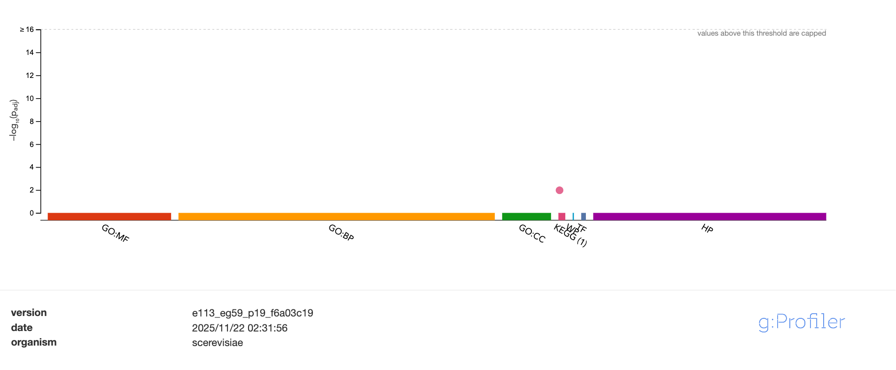

# 🪉 This document is about SV calling by long reads
🚨 If you don't believe in me, copy and paste this page into the chat box of an AI you trust to see whether they are correct. I ⚠️**highly recommend**⚠️ you to do this, because I maintain this repo myself, so it is easy for me to make some mistakes.

## 1. Environment Setup
This practice demands the following environment.
```bash
$ conda create yeast-sv
$ conda activate yeast-sv
$ conda install badread seqkit nanoplot chopper minimap2 samtools bcftools bedtools flye multiqc snpeff
$ pip install cutesv
```

## 2. Generate Simulation Reads
Let's assume you are in the working directory created in the previous alignment practice introduced in `01-Yeast-Alignment.md`.
```bash
$ mkdir sim_long_reads
$ badread simulate --reference ref_genome/yeast_sim_var_genome.fa --quantity 50x --glitches 10000,10,10 --junk_reads 0.1 --random_reads 0.1 --chimeras 0.1 --identity 20,3 | gzip > sim_long_reads/sl_reads.fastq.gz

Badread v0.4.1
long read simulation

Loading reference from ref_genome/yeast_sim_var_genome.fa
  17 contigs:
    ref|NC_001133|/1: 230,218 bp, linear, 1.00x depth
    ref|NC_001134|/1: 815,027 bp, linear, 1.00x depth
    ref|NC_001135|/1: 316,620 bp, linear, 1.00x depth
    ref|NC_001136|/1: 1,533,016 bp, linear, 1.00x depth
    ref|NC_001137|/1: 576,874 bp, linear, 1.00x depth
    ref|NC_001138|/1: 270,162 bp, linear, 1.00x depth
    ref|NC_001139|/1: 1,091,237 bp, linear, 1.00x depth
    ref|NC_001140|/1: 563,968 bp, linear, 1.00x depth
    ref|NC_001141|/1: 439,888 bp, linear, 1.00x depth
    ref|NC_001142|/1: 746,455 bp, linear, 1.00x depth
    ref|NC_001143|/1: 666,407 bp, linear, 1.00x depth
    ref|NC_001144|/1: 1,076,506 bp, linear, 1.00x depth
    ref|NC_001145|/1: 925,294 bp, linear, 1.00x depth
    ref|NC_001146|/1: 784,333 bp, linear, 1.00x depth
    ref|NC_001147|/1: 1,091,291 bp, linear, 1.00x depth
    ref|NC_001148|/1: 948,845 bp, linear, 1.00x depth
    ref|NC_001224|/1: 85,779 bp, linear, 1.00x depth
  total size: 12,161,920 bp

Generating fragment lengths from a gamma distribution:
  mean  =  15000 bp      parameters:
  stdev =  13000 bp        k (shape)     = 1.3314e+00
  N50   =  22622 bp        theta (scale) = 1.1267e+04
  │ ▖▌▌▖                                             
  │ ▌▌▌▌▌▌▖                                          
f │▌▌▌▌▌▌▌▌▌▖                                        
r │▌▌▌▌▌▌▌▌▌▌▌▖                                      
a │▌▌▌▌▌▌▌▌▌▌▌▌▌▖▖                                   
g │▌▌▌▌▌▌▌▌▌▌▌▌▌▌▌▌▌▖▖                               
s │▌▌▌▌▌▌▌▌▌▌▌▌▌▌▌▌▌▌▌▌▌▖▖▖                          
  │▌▌▌▌▌▌▌▌▌▌▌▌▌▌▌▌▌▌▌▌▌▌▌▌▌▌▌▌▌▖▖▖▖▖▖▖▖▖▖           
  ├─────────┬─────────┬─────────┬─────────┬─────────┐
  │       ▖▖▌▌▌▌▌▖▖                                  
  │      ▌▌▌▌▌▌▌▌▌▌▌▌▖                               
b │    ▖▌▌▌▌▌▌▌▌▌▌▌▌▌▌▌▌▖                            
a │   ▖▌▌▌▌▌▌▌▌▌▌▌▌▌▌▌▌▌▌▌▌▖▖                        
s │   ▌▌▌▌▌▌▌▌▌▌▌▌▌▌▌▌▌▌▌▌▌▌▌▌▖▖                     
e │  ▌▌▌▌▌▌▌▌▌▌▌▌▌▌▌▌▌▌▌▌▌▌▌▌▌▌▌▌▌▖▖▖                
s │ ▌▌▌▌▌▌▌▌▌▌▌▌▌▌▌▌▌▌▌▌▌▌▌▌▌▌▌▌▌▌▌▌▌▌▌▌▖▖▖▖         
  │▖▌▌▌▌▌▌▌▌▌▌▌▌▌▌▌▌▌▌▌▌▌▌▌▌▌▌▌▌▌▌▌▌▌▌▌▌▌▌▌▌▌▌▌▌▌▌▖▖▖
  ├─────────┬─────────┬─────────┬─────────┬─────────┐
  0         13600     27200     40800     54400     68000

Generating read qscores from a normal distribution:
  mean  =  20
  stdev =   3

Loading error model from /opt/miniconda3/envs/yeast-sv/lib/python3.12/site-packages/badread/error_models/nanopore2023.gz
  done: loaded error distributions for 16384 7-mers

Loading qscore model from /opt/miniconda3/envs/yeast-sv/lib/python3.12/site-packages/badread/qscore_models/nanopore2023.gz
  done: loaded qscore distributions for 10000 alignments

Read glitches:
  rate (mean distance between glitches) = 10000
  size (mean length of random sequence) =    10
  skip (mean sequence lost per glitch)  =    10

Start adapter:
  seq: AATGTACTTCGTTCAGTTACGTATTGCT
  rate:   90.0%
  amount: 60.0%

End adapter:
  seq: GCAATACGTAACTGAACGAAGT
  rate:   50.0%
  amount: 20.0%

Other problems:
  chimera join rate: 0.1%
  junk read rate:    0.1%
  random read rate:  0.1%

Target read set size: 608,096,000 bp

Simulating: 40,991 reads  608,108,101 bp  100.0%
```

## 3. QC
```bash
$ cd sim_long_reads/
$ seqkit -t dna -j 14 stats -a sl_reads.fastq.gz
file               format  type  num_seqs      sum_len  min_len   avg_len  max_len     Q1      Q2        Q3  sum_gap     N50  N50_num  Q20(%)  Q30(%)  AvgQual  GC(%)  sum_n
sl_reads.fastq.gz  FASTQ   DNA     40,991  608,108,101        2  14,835.2  128,208  5,473  11,339  20,501.5        0  22,545    7,437   83.79   64.18    17.83  38.21      0
$ mkdir QC
$ nanoplot -t 8 --fastq sl_reads.fastq.gz --verbose -o ./QC/
$ open QC/NanoPlot-report.html
```
As expected, our simulated long reads have very high quality. Note that more than 0.1 Gb are yielded by reads longer than 40 kb, which is great for SV calling. Then is the basic filtering.
```bash
$ chopper -i sl_reads.fastq.gz -q 7 -l 500 --trim-approach trim-by-quality --cutoff 7 -t 14 | gzip > filtered_reads.fastq.gz
Kept 40475 reads out of 40991 reads
$ seqkit -t dna -j 14 stats -a filtered_reads.fastq.gz
file                     format  type  num_seqs      sum_len  min_len   avg_len  max_len       Q1      Q2        Q3  sum_gap     N50  N50_num  Q20(%)  Q30(%)  AvgQual  GC(%)  sum_n
filtered_reads.fastq.gz  FASTQ   DNA     40,475  607,957,605      500  15,020.6  128,208  5,657.5  11,514  20,703.5        0  22,554    7,424   83.79   64.18    17.83  38.21      0
$ mkdir QC_filter
$ nanoplot -t 8 --fastq filtered_reads.fastq.gz -o QC_filter/
$ open QC_filter/NanoPlot-report.html
```
Since we aim to call SVs, we are more tolerant of low-quality bases. Overall, this does not lead to major changes in our data. The most noticeable feature is the **top 5 reads with the highest mean basecall quality scores and their read lengths**. Note that we are not dealing with adapters. This is because most adapters are cut by the basecallers, and the residual adapters are often very short and neglectable compared to the read length. The aligners are also robust enough to handle the soft clips at the end of reads.

## 4. Alignment
```bash
$ cd ..
$ mkdir long_align
$ minimap2 -t 8 -ax map-ont ref_genome/S288C_reference_sequence_R64-5-1_20240529.fa sim_long_reads/filtered_reads.fastq.gz | samtools sort -@ 8 -o long_align/yeast_long_align.bam
[M::mm_idx_gen::0.156*1.03] collected minimizers
[M::mm_idx_gen::0.177*1.84] sorted minimizers
[M::main::0.177*1.84] loaded/built the index for 17 target sequence(s)
[M::mm_mapopt_update::0.194*1.76] mid_occ = 33
[M::mm_idx_stat] kmer size: 15; skip: 10; is_hpc: 0; #seq: 17
[M::mm_idx_stat::0.211*1.70] distinct minimizers: 2084917 (95.68% are singletons); average occurrences: 1.093; average spacing: 5.336; total length: 12157105
[M::worker_pipeline::18.942*6.75] mapped 33328 sequences
[M::worker_pipeline::21.656*6.87] mapped 7147 sequences
[M::main] Version: 2.30-r1287
[M::main] CMD: minimap2 -t 8 -ax map-ont ref_genome/S288C_reference_sequence_R64-5-1_20240529.fa sim_long_reads/filtered_reads.fastq.gz
[M::main] Real time: 21.665 sec; CPU: 148.723 sec; Peak RSS: 1.934 GB
[bam_sort_core] merging from 0 files and 8 in-memory blocks...
$ samtools index long_align/yeast_long_align.bam
```

## 5. QC for alignment
```bash
$ samtools flagstats long_align/yeast_long_align.bam
42823 + 0 in total (QC-passed reads + QC-failed reads)
40475 + 0 primary
2178 + 0 secondary
170 + 0 supplementary
0 + 0 duplicates
0 + 0 primary duplicates
42753 + 0 mapped (99.84% : N/A)
40405 + 0 primary mapped (99.83% : N/A)
0 + 0 paired in sequencing
0 + 0 read1
0 + 0 read2
0 + 0 properly paired (N/A : N/A)
0 + 0 with itself and mate mapped
0 + 0 singletons (N/A : N/A)
0 + 0 with mate mapped to a different chr
0 + 0 with mate mapped to a different chr (mapQ>=5)
```
It seems like **FLAG** cannot offer much useful information for long read alignment.
```bash
$ samtools idxstats long_align/yeast_long_align.bam
ref|NC_001133|	230218	779	0
ref|NC_001134|	813184	2740	0
ref|NC_001135|	316620	1113	0
ref|NC_001136|	1531933	5390	0
ref|NC_001137|	576874	2097	0
ref|NC_001138|	270161	914	0
ref|NC_001139|	1090940	3809	0
ref|NC_001140|	562643	2040	0
ref|NC_001141|	439888	1524	0
ref|NC_001142|	745751	2629	0
ref|NC_001143|	666816	2207	0
ref|NC_001144|	1078177	3963	0
ref|NC_001145|	924431	3235	0
ref|NC_001146|	784333	2758	0
ref|NC_001147|	1091291	3865	0
ref|NC_001148|	948066	3403	0
ref|NC_001224|	85779	287	0
*	0	0	70
```
Note that there is a difference of 70 between `40475 + 0 primary` and `40405 + 0 primary mapped (99.83% : N/A)`. The fourth column output by `samtools idxstats` is umapped reads, and coincides to be 70. Take the bitwise code of **FLAG** into consideration, all unmapped reads are mistaken for primary mapped for some unknown reason.
```bash
$ samtools depth -@ 8 long_align/yeast_long_align.bam  | awk '{sum+=$3} END {print "sequencing depth:", sum/NR}'
sequencing depth: 49.6784
```
The sequencing depth is perfectly what we expect.
```bash
$ cd long_align/
$ mkdir QC
$ nanoplot -t 8 --bam yeast_long_align.bam -o QC/
$ open QC/NanoPlot-report.html
```
The quality report seems like there is no abnormal.

## 6. Structural Variant Calling
```bash
$ cd ..
$ mkdir sv_call
$ bcftools view var_call/yeast_sim_vars.vcf | grep -v -e snp -e small_indel > sv_call/yeast_sim_sv.vcf
$ bgzip sv_call/yeast_sim_sv.vcf
$ bcftools index sv_call/yeast_sim_sv.vcf.gz
$ cutesv long_align/yeast_long_align.bam ref_genome/S288C_reference_sequence_R64-5-1_20240529.fa sv_call/yeast_sv.vcf sv_call/ -p -1 -l 100 --max_cluster_bias_DEL 100 --diff_ratio_merging_DEL 0.3 
2025-11-16 00:37:26,462 [INFO] Running /opt/miniconda3/envs/yeast-sv/bin/cutesv long_align/yeast_long_align.bam ref_genome/S288C_reference_sequence_R64-5-1_20240529.fa sv_call/yeast_sv.vcf sv_call/ -p -1 -l 100 --max_cluster_bias_DEL 100 --diff_ratio_merging_DEL 0.3
2025-11-16 00:37:26,462 [INFO] The total number of chromsomes: 17
2025-11-16 00:37:27,330 [INFO] Rebuilding signatures of structural variants.
2025-11-16 00:37:27,565 [INFO] Rebuilding signatures completed.
2025-11-16 00:37:27,565 [INFO] Clustering structural variants.
2025-11-16 00:37:27,805 [INFO] Writing to your output file.
2025-11-16 00:37:28,080 [INFO] Cleaning temporary files.
2025-11-16 00:37:28,101 [INFO] Finished in 1.64 seconds.
$ cd sv_call
$ bgzip yeast_sv.vcf
$ bcftools index yeast_sv.vcf.gz
```
Enable genotyping.
```bash
$ cutesv long_align/yeast_long_align.bam ref_genome/S288C_reference_sequence_R64-5-1_20240529.fa sv_call/yeast_sv_gt.vcf sv_call/ -p -1 -l 100 --max_cluster_bias_DEL 100 --diff_ratio_merging_DEL 0.3 --genotype
2025-11-16 01:00:08,843 [INFO] Running /opt/miniconda3/envs/yeast-sv/bin/cutesv long_align/yeast_long_align.bam ref_genome/S288C_reference_sequence_R64-5-1_20240529.fa sv_call/yeast_sv_gt.vcf sv_call/ -p -1 -l 100 --max_cluster_bias_DEL 100 --diff_ratio_merging_DEL 0.3 --genotype
2025-11-16 01:00:08,843 [INFO] The total number of chromsomes: 17
2025-11-16 01:00:09,713 [INFO] Rebuilding signatures of structural variants.
2025-11-16 01:00:09,953 [INFO] Rebuilding signatures completed.
2025-11-16 01:00:09,953 [INFO] Clustering structural variants.
2025-11-16 01:00:10,177 [INFO] Writing to your output file.
2025-11-16 01:00:10,413 [INFO] Cleaning temporary files.
2025-11-16 01:00:10,432 [INFO] Finished in 1.59 seconds.
$ bgzip yeast_sv_gt.vcf
$ bcftools index yeast_sv_gt.vcf.gz
```
Note that the genotyping model used by `cutesv` is diploid. However, in our simulation design, we assume the yeast is in the haploid life cycle. We need to verify the detected SVs manually later. Primarily check the SV calling results.
```bash
$ bcftools query -f "%CHROM\n" yeast_sim_sv.vcf.gz | uniq
ref|NC_001134|
ref|NC_001136|
ref|NC_001137|
ref|NC_001139|
ref|NC_001140|
ref|NC_001142|
ref|NC_001143|
ref|NC_001144|
ref|NC_001145|
ref|NC_001148|
$ bcftools query -f "%CHROM\n" yeast_sv.vcf.gz | uniq
ref|NC_001134|
ref|NC_001136|
ref|NC_001137|
ref|NC_001139|
ref|NC_001140|
ref|NC_001142|
ref|NC_001143|
ref|NC_001144|
ref|NC_001145|
ref|NC_001148|
```
From the perspective of chromosomes alone, the SV calling is accurate. Get some basic information of the variants we found.
```bash
$ bcftools query -f "%CHROM\t%POS\t%ID\t%QUAL\t%AF\t[%GT\t%DR\t%DV]" yeast_sv_gt.vcf.gz | column -t
ref|NC_001134|  33441    cuteSV.DEL.0   2.2    0.2642  0/0  39  14
ref|NC_001134|  33687    cuteSV.INS.0   179.8  0.7143  0/1  12  30
ref|NC_001136|  226628   cuteSV.INS.1   439    1       1/1  0   46
ref|NC_001136|  1024564  cuteSV.INS.2   486.7  1       1/1  0   51
ref|NC_001137|  82013    cuteSV.INV.0   334    1       1/1  0   35
ref|NC_001137|  82014    cuteSV.INV.1   334    1       1/1  0   35
ref|NC_001137|  193928   cuteSV.INS.3   439    1       1/1  0   46
ref|NC_001137|  194735   cuteSV.DEL.1   477.1  1       1/1  0   50
ref|NC_001139|  69565    cuteSV.INS.4   429.4  1       1/1  0   45
ref|NC_001139|  644616   cuteSV.INS.5   267.2  0.8182  1/1  8   36
ref|NC_001139|  644620   cuteSV.DEL.2   0      0.2174  0/0  36  10
ref|NC_001139|  646540   cuteSV.DEL.3   286.3  0.8125  1/1  9   39
ref|NC_001140|  101204   cuteSV.INS.6   362.6  0.88    1/1  6   44
ref|NC_001142|  533872   cuteSV.INS.7   477.1  1       1/1  0   50
ref|NC_001143|  220551   cuteSV.DEL.4   610.7  1       1/1  0   64
ref|NC_001144|  754220   cuteSV.DEL.5   534.4  1       1/1  0   56
ref|NC_001145|  271865   cuteSV.INS.8   524.8  1       1/1  0   55
ref|NC_001145|  525628   cuteSV.INS.9   534.4  1       1/1  0   56
ref|NC_001145|  679317   cuteSV.INS.10  324.4  0.925   1/1  3   37
ref|NC_001145|  681147   cuteSV.DEL.6   362.6  0.9318  1/1  3   41
ref|NC_001148|  121083   cuteSV.INS.11  429.4  1       1/1  0   45
```
Compare it with the ground truth.
```bash
$ bcftools query -f "%CHROM\t%POS\t%ID\n" yeast_sim_sv.vcf.gz | awk '!id[$3]++'
ref|NC_001134|	31587	sim_dup_0
ref|NC_001136|	226629	sim_sv_indel_0
ref|NC_001136|	1023566	sim_dup_1
ref|NC_001137|	82012	sim_inv_0
ref|NC_001137|	193928	sim_trans_0
ref|NC_001139|	69565	sim_sv_indel_1
ref|NC_001139|	644619	sim_trans_1
ref|NC_001140|	99327	sim_dup_2
ref|NC_001142|	533872	sim_sv_indel_2
ref|NC_001143|	220551	sim_sv_indel_3
ref|NC_001144|	754220	sim_sv_indel_4
ref|NC_001145|	271865	sim_sv_indel_5
ref|NC_001145|	524877	sim_dup_3
ref|NC_001145|	679317	sim_trans_2
ref|NC_001148|	121083	sim_sv_indel_6
```
For example, on `ref|NC_001134|`, we only have one interspersed duplication, while it is split by `cuteSV` into two adjacent indels. We probably need to revise the variants manually. However, we don't have the ground truth in reality. It is too tedious to check each variant call. Do we have a more advanced method? We can perform de novo assembly locally at each SV site.

## 7. Local de novo Assembly SV Site Refinement
Extract the related reads at each site first.
```bash
$ mkdir local_assembly
$ bcftools query -f "%CHROM\t%POS\t%END\n" sv_call/yeast_sv.vcf.gz | awk -v OFS="\t" '{print $1, $2-1, $3}' > local_assembly/sv_intervals.bed
$ bedtools slop -i local_assembly/sv_intervals.bed -g ref_genome/chr_size.genome -b 2000 > local_assembly/sv_regions.bed
$ bedtools merge -i local_assembly/sv_regions.bed > local_assembly/sv_region_nooverlap.bed
$ samtools view -b -L local_assembly/sv_region_nooverlap.bed long_align/yeast_long_align.bam > local_assembly/site_reads.bam
$ samtools view local_assembly/site_reads.bam | cut -d $'\t' -f 1 | sort | uniq > local_assembly/site_reads_ids.txt
$ seqkit -t dna -j 8 grep -f local_assembly/site_reads_ids.txt sim_long_reads/sl_reads.fastq.gz -o local_assembly/site_reads.fastq
```
Estimated genome size is needed for assembly.
```bash
$ awk -v OFS="\t" '{sum+=$3-$2} END {print (sum/100)}' local_assembly/sv_region_nooverlap.bed
778.09
```
Take `800 kb` as the estimated genome size.
```bash
$ mkdir local_assembly/flye
$ flye --nano-hq local_assembly/site_reads.fastq -o local_assembly/flye/ -g 800k -t 14
[2025-11-20 23:08:46] INFO: Starting Flye 2.9.6-b1802
[2025-11-20 23:08:46] INFO: >>>STAGE: configure
[2025-11-20 23:08:46] INFO: Configuring run
[2025-11-20 23:08:46] INFO: Total read length: 24990535
[2025-11-20 23:08:46] INFO: Input genome size: 800000
[2025-11-20 23:08:46] INFO: Estimated coverage: 31
[2025-11-20 23:08:46] INFO: Reads N50/N90: 34043 / 12421
[2025-11-20 23:08:46] INFO: Minimum overlap set to 10000
[2025-11-20 23:08:46] INFO: >>>STAGE: assembly
[2025-11-20 23:08:46] INFO: Assembling disjointigs
[2025-11-20 23:08:46] INFO: Reading sequences
[2025-11-20 23:08:46] INFO: Building minimizer index
[2025-11-20 23:08:46] INFO: Pre-calculating index storage
0% 10% 20% 30% 40% 50% 60% 70% 80% 90% 100% 
[2025-11-20 23:08:47] INFO: Filling index
0% 10% 20% 30% 40% 50% 60% 70% 80% 90% 100% 
[2025-11-20 23:08:51] INFO: Extending reads
[2025-11-20 23:09:28] INFO: Overlap-based coverage: 27
[2025-11-20 23:09:28] INFO: Median overlap divergence: 0.0223503
0% 10% 20% 30% 40% 50% 60% 70% 80% 90% 100% 
[2025-11-20 23:09:28] INFO: Assembled 14 disjointigs
[2025-11-20 23:09:28] INFO: Generating sequence
0% 10% 20% 30% 40% 50% 60% 70% 80% 90% 100% 
[2025-11-20 23:09:29] INFO: Filtering contained disjointigs
0% 10% 20% 30% 40% 50% 60% 70% 80% 90% 100% 
[2025-11-20 23:09:29] INFO: Contained seqs: 0
[2025-11-20 23:09:29] INFO: >>>STAGE: consensus
[2025-11-20 23:09:29] INFO: Running Minimap2
[2025-11-20 23:09:30] INFO: Computing consensus
[2025-11-20 23:09:31] INFO: Alignment error rate: 0.028189
[2025-11-20 23:09:31] INFO: >>>STAGE: repeat
[2025-11-20 23:09:31] INFO: Building and resolving repeat graph
[2025-11-20 23:09:31] INFO: Parsing disjointigs
[2025-11-20 23:09:31] INFO: Building repeat graph
0% 10% 20% 30% 40% 50% 60% 70% 80% 90% 100% 
[2025-11-20 23:09:32] INFO: Median overlap divergence: 0
[2025-11-20 23:09:32] INFO: Parsing reads
[2025-11-20 23:09:32] INFO: Aligning reads to the graph
0% 10% 20% 30% 40% 50% 60% 70% 80% 90% 100% 
[2025-11-20 23:09:32] INFO: Aligned read sequence: 22971136 / 23413278 (0.981116)
[2025-11-20 23:09:32] INFO: Median overlap divergence: 0.0106633
[2025-11-20 23:09:32] INFO: Mean edge coverage: 14
[2025-11-20 23:09:32] INFO: Simplifying the graph
[2025-11-20 23:09:32] INFO: >>>STAGE: contigger
[2025-11-20 23:09:32] INFO: Generating contigs
[2025-11-20 23:09:32] INFO: Reading sequences
[2025-11-20 23:09:32] INFO: Generated 14 contigs
[2025-11-20 23:09:32] INFO: Added 0 scaffold connections
[2025-11-20 23:09:32] INFO: >>>STAGE: polishing
[2025-11-20 23:09:32] INFO: Polishing genome (1/1)
[2025-11-20 23:09:32] INFO: Running minimap2
[2025-11-20 23:09:33] INFO: Separating alignment into bubbles
[2025-11-20 23:09:35] INFO: Alignment error rate: 0.014619
[2025-11-20 23:09:35] INFO: Correcting bubbles
0% 10% 20% 30% 40% 50% 60% 70% 80% 90% 100% 
[2025-11-20 23:09:38] INFO: >>>STAGE: finalize
[2025-11-20 23:09:38] INFO: Assembly statistics:

	Total length:	1639585
	Fragments:	14
	Fragments N50:	112403
	Largest frg:	251305
	Scaffolds:	0
	Mean coverage:	8

[2025-11-20 23:09:38] INFO: Final assembly: /.../local_assembly/flye/assembly.fasta
```
I adjust the output `/.../local_assembly/flye/assembly.fasta` that the very long path from `/` to `local_assembly/` is replaced with `...`. The actual output by `flye` is the intact path.
```bash
$ cd local_assembly/flye/
$ seqkit stats -a assembly.fasta
file            format  type  num_seqs    sum_len  min_len    avg_len  max_len      Q1         Q2       Q3  sum_gap      N50  N50_num  Q20(%)  Q30(%)  AvgQual  GC(%)  sum_n
assembly.fasta  FASTA   DNA         14  1,639,585   86,171  117,113.2  251,305  89,225  104,202.5  120,063        0  112,403        6       0       0        0  38.11      0
```
Now we can align theses contigs.
```bash
$ cd ../..
$ mkdir local_align
$ minimap2 -ax asm5 --cs -t 8 ref_genome/S288C_reference_sequence_R64-5-1_20240529.fa local_assembly/flye/assembly.fasta | samtools sort -o local_align/local_assembly_align.bam
[M::mm_idx_gen::0.142*1.03] collected minimizers
[M::mm_idx_gen::0.154*1.54] sorted minimizers
[M::main::0.154*1.54] loaded/built the index for 17 target sequence(s)
[M::mm_mapopt_update::0.163*1.51] mid_occ = 50
[M::mm_idx_stat] kmer size: 19; skip: 19; is_hpc: 0; #seq: 17
[M::mm_idx_stat::0.169*1.49] distinct minimizers: 1149976 (98.19% are singletons); average occurrences: 1.058; average spacing: 9.989; total length: 12157105
[M::worker_pipeline::0.261*2.32] mapped 14 sequences
[M::main] Version: 2.30-r1287
[M::main] CMD: minimap2 -ax asm5 --cs -t 8 ref_genome/S288C_reference_sequence_R64-5-1_20240529.fa local_assembly/flye/assembly.fasta
[M::main] Real time: 0.265 sec; CPU: 0.608 sec; Peak RSS: 0.184 GB
$ samtools index local_align/local_assembly_align.bam
```
Try assembly-based SV calling.
```bash
$ cutesv local_align/local_assembly_align.bam ref_genome/S288C_reference_sequence_R64-5-1_20240529.fa sv_call/yeast_local_asm_sv.vcf ./ -s 1 --report_readid -p -1 -mi 300 -md 300 -l 100 --max_cluster_bias_INS 100 --diff_ratio_merging_INS 0.3 --max_cluster_bias_DEL 100 --diff_ratio_merging_DEL 0.3
2025-11-21 12:05:12,501 [INFO] Running /opt/miniconda3/envs/yeast-sv/bin/cutesv local_align/local_assembly_align.bam ref_genome/S288C_reference_sequence_R64-5-1_20240529.fa sv_call/yeast_local_asm_sv.vcf ./ -s 1 --report_readid -p -1 -mi 300 -md 300 -l 100 --max_cluster_bias_INS 100 --diff_ratio_merging_INS 0.3 --max_cluster_bias_DEL 100 --diff_ratio_merging_DEL 0.3
2025-11-21 12:05:12,502 [INFO] The total number of chromsomes: 17
2025-11-21 12:05:13,789 [INFO] Rebuilding signatures of structural variants.
2025-11-21 12:05:14,782 [INFO] Rebuilding signatures completed.
2025-11-21 12:05:14,782 [INFO] Clustering structural variants.
2025-11-21 12:05:15,648 [INFO] Writing to your output file.
2025-11-21 12:05:16,705 [INFO] Cleaning temporary files.
2025-11-21 12:05:16,725 [INFO] Finished in 4.22 seconds.
$ bgzip sv_call/yeast_local_asm_sv.vcf
$ bcftools index sv_call/yeast_local_asm_sv.vcf.gz
```
In our case, there are only 15 contigs. `--max_cluster_bias_INS` and `--max_cluster_bias_DEL` are not that useful, since each site can probably has only one signal. Enable genotyping.
```bash
$ cutesv local_align/local_assembly_align.bam ref_genome/S288C_reference_sequence_R64-5-1_20240529.fa sv_call/yeast_local_asm_sv_gt.vcf ./ -s 1 --report_readid -p -1 -mi 300 -md 300 -l 100 --max_cluster_bias_INS 100 --diff_ratio_merging_INS 0.3 --max_cluster_bias_DEL 100 --diff_ratio_merging_DEL 0.3 --genotype
2025-11-21 12:09:16,026 [INFO] Running /opt/miniconda3/envs/yeast-sv/bin/cutesv local_align/local_assembly_align.bam ref_genome/S288C_reference_sequence_R64-5-1_20240529.fa sv_call/yeast_local_asm_sv_gt.vcf ./ -s 1 --report_readid -p -1 -mi 300 -md 300 -l 100 --max_cluster_bias_INS 100 --diff_ratio_merging_INS 0.3 --max_cluster_bias_DEL 100 --diff_ratio_merging_DEL 0.3 --genotype
2025-11-21 12:09:16,026 [INFO] The total number of chromsomes: 17
2025-11-21 12:09:17,106 [INFO] Rebuilding signatures of structural variants.
2025-11-21 12:09:18,185 [INFO] Rebuilding signatures completed.
2025-11-21 12:09:18,185 [INFO] Clustering structural variants.
2025-11-21 12:09:19,103 [INFO] Writing to your output file.
2025-11-21 12:09:20,192 [INFO] Cleaning temporary files.
2025-11-21 12:09:20,213 [INFO] Finished in 4.19 seconds.
$ bgzip sv_call/yeast_local_asm_sv_gt.vcf
$ bcftools index sv_call/yeast_local_asm_sv_gt.vcf.gz
```
Check out the results.
```bash
$ bcftools query -f "%CHROM\t%ID\t%QUAL\t%AF\t[%GT\t%DR\t%DV]" sv_call/yeast_local_asm_sv_gt.vcf.gz | column -t
ref|NC_001134|  cuteSV.INS.0   11.8  1  1/1  0  1
ref|NC_001136|  cuteSV.INS.1   11.8  1  1/1  0  1
ref|NC_001136|  cuteSV.BND.0   11.8  1  1/1  0  1
ref|NC_001136|  cuteSV.INS.2   11.8  1  1/1  0  1
ref|NC_001137|  cuteSV.INV.0   11.8  1  1/1  0  1
ref|NC_001137|  cuteSV.INV.1   11.8  1  1/1  0  1
ref|NC_001137|  cuteSV.INS.3   11.8  1  1/1  0  1
ref|NC_001137|  cuteSV.DEL.0   11.8  1  1/1  0  1
ref|NC_001139|  cuteSV.INS.4   11.8  1  1/1  0  1
ref|NC_001139|  cuteSV.INS.5   11.8  1  1/1  0  1
ref|NC_001139|  cuteSV.DEL.1   11.8  1  1/1  0  1
ref|NC_001140|  cuteSV.INS.6   11.8  1  1/1  0  1
ref|NC_001142|  cuteSV.INS.7   11.8  1  1/1  0  1
ref|NC_001143|  cuteSV.DEL.2   11.8  1  1/1  0  1
ref|NC_001144|  cuteSV.DEL.3   11.8  1  1/1  0  1
ref|NC_001145|  cuteSV.INS.8   11.8  1  1/1  0  1
ref|NC_001145|  cuteSV.INS.9   11.8  1  1/1  0  1
ref|NC_001145|  cuteSV.INS.10  11.8  1  1/1  0  1
ref|NC_001145|  cuteSV.DEL.4   11.8  1  1/1  0  1
ref|NC_001148|  cuteSV.INS.11  11.8  1  1/1  0  1
```
I don't know how to discover duplications and intra-chromosomal translocations effectively. If you know how to resolve this problem, please leave an issue. We will go to next step and skip this problem for them moment.

## 8. QC for SV calling
```bash
$ mkdir sv_call/QC_align
$ mkdir sv_call/QC_assembly
$ bcftools stats sv_call/yeast_sv_gt.vcf.gz > sv_call/QC_align/stats.txt
$ bcftools stats sv_call/yeast_local_asm_sv_gt.vcf.gz > sv_call/QC_assembly/stats.txt
$ multiqc -o sv_call/QC_align/ sv_call/QC_align/
$ multiqc -o sv_call/QC_assembly/ sv_call/QC_assembly/
$ open sv_call/QC_align/multiqc_report.html
$ open sv_call/QC_assembly/multiqc_report.html
```
Note that there are not many useful visualized QC metrics.

## 9. Annotation
Although I tried to refine the SV calls with local de novo assembly, it still makes little difference and env reported a fake translocation (`cuteSV.BND.0`). However, at least the positions are accurate. I will directly annotate the SVs. If some significant biological effects are found, then let's revisit the specific SV sites and refine the SV type manually. Recall that we have built a database with `snpeff`. Now we are going to utilize it.
```bash
$ mkdir sv_ann
$ snpeff ann -c snpeff/snpEff.config -v -stats sv_ann/snpEff_summary.html SC_SGD sv_call/yeast_local_asm_sv_gt.vcf.gz 2>snpeff_sv.log | gzip -c > sv_ann/yeast_local_asm_sv_gt.ann.vcf.gz
$ open sv_ann/snpEff_summary.html
```
The report is similar to what we have done in calling SNPs and small indels.

## 10. Biological Interpretation
Extract the genes that have HIGH and MODERATE impact.
```bash
$ cut -d $'\t' -f 1-6 sv_ann/snpEff_summary.genes.txt | awk '$5 != 0 || $6 != 0 {print $1}' | grep -v '^#' | sed 's/_.*$//' > sv_ann/geneslist.txt
```
Go to [g:Profiler](https://biit.cs.ut.ee/gprofiler/gost). Copy and paste the list we just obtained, choose organism (Saccharomyces cerevisiae), and click 'Run query'.


Only Sphingolipid metabolism shows biological significance. Maybe enrichment analysis is not very suitable for SVs. I don't know what could I do for the moment. I appreciate it if you would like to contribute and leave an issue.